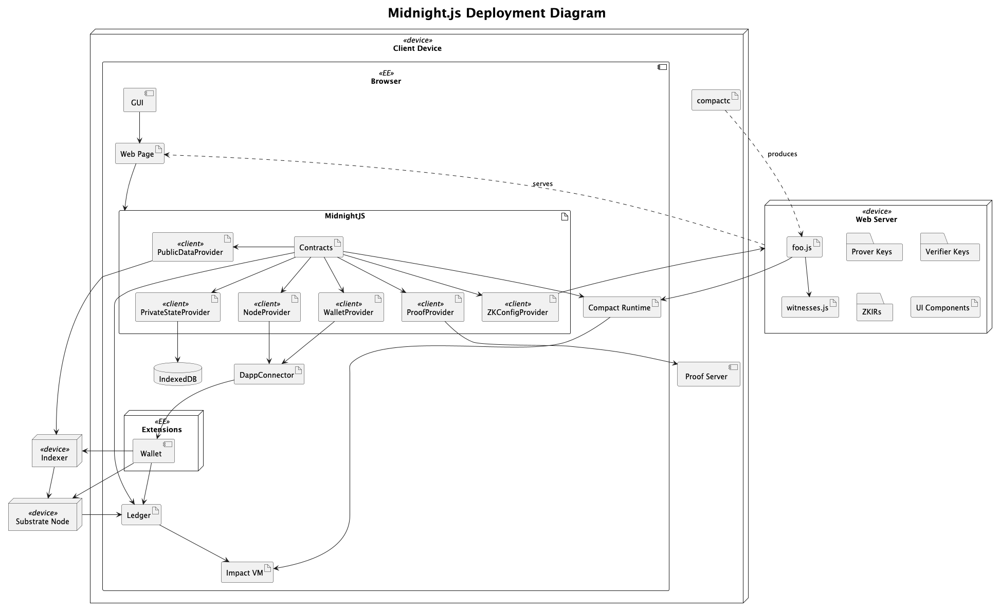
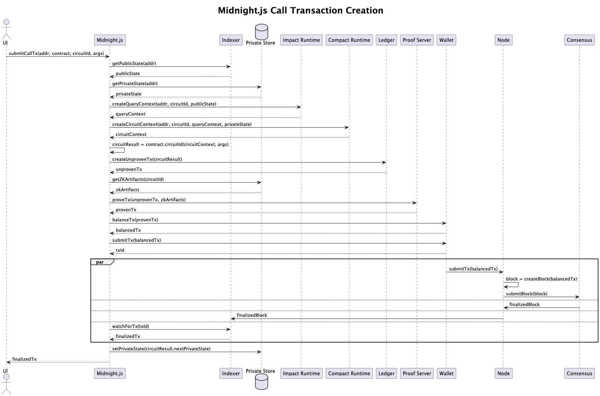

# Midnight.js

## Introduction

Midnight.js is a Typescript-based application development framework for the
Midnight blockchain. Similar to [Web3.js](https://web3js.org/) for Ethereum or
[polkadot.js](https://polkadot.js.org/) for Polkadot, it provides utilities for:

- Creating and submitting transactions
- Interacting with wallets
- Querying for block and contract state information
- Subscribing to chain events

Because of the privacy-preserving properties of the Midnight system, Midnight.js
also contains several unique utilities:

- Executing smart contracts locally
- Incorporating private state into contract execution
- Persisting, querying, and updating private state
- Creating and verifying zero-knowledge proofs

Midnight.js orchestrates all required interactions among the various Midnight
system APIs needed to create and submit a transaction to the Midnight
blockchain. These APIs include an indexer, a proof server, a private state
store, a Midnight node, a wallet, the ledger, the Compact contract runtime, and
a cryptographic artifact (proving key, verifying key, and ZKIR) repository. It
provides default implementations for each of the aforementioned APIs, e.g. a
GraphQL client for the indexer.

### Contracts

> This section assumes the reader has a working understanding of the Compact
> language.

When a user compiles a Compact smart contract with compactc, they obtain two
files:

1. A JavaScript file
2. A
   TypeScript [declaration file](https://www.typescriptlang.org/docs/handbook/2/type-declarations.html)

The JavaScript file contains:

- The execution logic for each circuit in the source contract
- Logic for constructing the contract’s initial state
- Utilities for converting on-chain contract state into a JavaScript
  representation

Midnight.js uses this file at run time to execute circuits. The circuit
execution results are then used to create transactions.

> The term _runtime_ is often used to describe the JS executable for a
> contract. This is distinct from the package `@midnight-ntwrk/compact-runtime`,
> which provides the utilities each executable uses.

The TypeScript declaration file contains:

- A type definition for the contract, named `Contract`
- A type definition for any circuits defined within the contract
- A type definition for all required witnesses, named `Witnesses`
- A type definition for the contract’s on-chain state, named `Ledger`

If the user’s Compact source code includes `witness` declarations, the
generated TypeScript declaration file defines a `Witnesses` type as a non-empty
object with a generic type parameter `PS`, representing the private state that
witnesses modify during circuit execution. The user must supply an
implementation of `Witnesses` to a `Contract` and execute a circuit.

Midnight.js uses the TS declaration file at compile time to ensure the contract
is consumed in a type-safe manner. For example, Midnight.js infers circuit
argument and return types from the TS declaration file then uses them as generic
constraints in various utility functions.

### Objectives and Requirements

This section lists a set of design considerations and requirements for
Midnight.js.

#### Type-Safety

* Should preserve a contract's circuit argument/return types and
  user defined types, e.g. `PS` and `Witnesses` types, throughout its
  data model, interfaces, and utility functions.
* Should attempt to infer types, e.g. `infer`, in its functions and data model
  instead of introducing additional generic parameters.
* Should use the least restrictive generic constraints necessary for type safety
  in its functions and data model.
* Should use `any` only for user-supplied types that are truly
  unconstrained. It should not use `any` merely to “fix” compilation issues.
* Should not require its users to manually specify concrete types for
  generic parameters in most scenarios.
* Should employ branded types to distinguish domain concepts that
  share the same in-code representation, e.g. `HexString` vs. `string`.

In general, these guidelines maximize compile-time checks and enable intuitive
autocompletion when using Midnight.js.

#### Modularity

* Should allow users to provide custom implementations of API
  clients to transaction construction utilities. This is currently accomplished
  via the "provider" pattern.
* Should collect commonly used types into a single package, e.g.
  `@midnight-ntwrk/midnight-js-types`, to standardize types across applications
  and promote programming to interfaces instead of concrete types.

#### Interoperability

* Should be as _isomorphic_ as possible. It should largely work in
  both browser and Node.js environments.
* Should allow dApps to run against different Midnight networks,
  e.g. TestNet vs MainNet.

### Reusability

* Should build high-level features, e.g. transaction construction,
  from low-level utility functions, and it should export both the high-level
  features and low-level functions. This allows users to assemble their own
  high-level features from the set of basic capabilities Midnight.js exposes.
* Should provide a default implementation of each API client needed
  to construct or submit a transaction.
* Should place each API client implementation in a separate package.
  This ensures users can select only the package they need for their
  application.

### Usability

* Should aim to minimize the boilerplate required to set up a dApp.
  This includes reducing the ceremony required to configure API clients.
* Should supply common sense default settings to avoid common application errors,
  e.g. subscribing to an indexer stream that causes the application to hang indefinitely.

### Security

* Should store and manipulate and store sensitive data, i.e.
  contract private states, securely.

> Midnight.js currently falls short of this goal; the default
> `PrivateStateProvider` based on `LevelDb` does not encrypt data at rest. To
> encrypt data, a password scheme would likely be necessary. But, requiring
> the user to input a password any time an application they're using needs to
> send a transaction would significantly degrade the UX. This issue should be
> prioritized and resolved.

# Architecture

## Structure

The following diagram is a Midnight.js-centric deployment diagram for the Midnight system.



The elements of the diagram roughly correspond to these packages:

| Element              | Package                                                  |
|----------------------|----------------------------------------------------------|
| `Contracts`            | @midnight-ntwrk/midnight-js-contracts                    |
| `PublicDataProvider`   | @midnight-ntwrk/midnight-js-contracts                    |
| `PrivateStateProvider` | @midnight-ntwrk/midnight-js-level-private-state-provider |
| `ProofProvider`        | @midnight-ntwrk/midnight-js-http-client-proof-provider   |
| `ZKConfigProvider`     | @midnight-ntwrk/midnight-js-fetch-zk-config-provider     |
| `DappConnector`        | @midnight-ntwrk/dapp-connector-api                       |
| `Wallet`               | @midnight-ntwrk/wallet                                   |
| `Ledger`               | @midnight-ntwrk/ledger                                   |
| `Compact Runtime`      | @midnight-ntwrk/compact-runtime                          |
| `Impact VM`            | @midnight-ntwrk/onchain-runtime                          |

The `Contracts` element contains utilities that the web page uses to create and
submit transactions. Each of the clients in `Midnight.js` are concrete instances
of the provider interfaces defined in the `@midnight-ntwrk/midnight-js-types` package.

The dark arrow from `GUI` to `Web Page` indicates that the GUI for a given application may depend
on any of the packages in Midnight.js. The dashed arrow from `compactc` to `Contract` indicates
that the application developer has run `compactc` on a Compact source file `foo.compact` and produced an executable, `foo.js`.
The `Contracts` element uses the `foo.js` and `witnesses.js` programs stored on the web server to execute circuits and create unproven transactions,
and it uses the `Prover Keys`, `Verifier Keys`, and `ZKIRs` to prove those transactions. `Midnight.js` does not depend on `UI Components` because
UI components are created using Midnight.js.

There are two additional things to note about this diagram:

1. `Ledger` and `Compact Runtime` both depend on the `Impact VM` (on-chain runtime).
2. `Midnight.js` and `Substrate Node` both depend on the `Ledger`.

The first fact allows us to "rehearse" a circuit call (which involves running Impact VM) in
such a way that the execution can be replayed on the node. The second fact allows us to create
a transaction from the result of the circuit rehearsal that the node will accept.

Finally, note that `NodeProvider` depends on the `DappConnector`. This is because we used
the wallet to balance and submit transactions.

## Behavior

The following is a sequence diagram for the construction of a typical call transaction.



# Glossary

- Witness - A private computation performed only on the end user's device. The name
  and type signature of a witness is declared in Compact source. The application
  developer them provides a TypeScript implementation of that witness to use
  for circuit execution.
- Private state - The state updated by a witness and stored on the end user's device.

## Package structure

This is a yarn [workspaces](https://yarnpkg.com/features/workspaces/) project. All packages live in the [`packages`](packages) directory:

- `types` - Contains types and interfaces common to all other packages.
- `contracts` - Contains utilities for interacting with Midnight smart contracts.
- `indexer-public-data-provider` - Contains a cross-environment implementation of a Midnight indexer client.
- `node-zk-config-provider` - Contains a file system based Node.js utility for retrieving zero-knowledge artifacts.
- `fetch-zk-config-provider` - Contains a [fetch](https://developer.mozilla.org/en-US/docs/Web/API/Fetch_API) based cross-environment utility for retrieving zero-knowledge artifacts.
- `network-id` - Contains utilities for setting the network id used by `ledger`, `zswap`, and `compact-runtime` dependencies.
- `http-client-proof-provider` - Contains a cross-environment implementation of a proof-server client.
- `level-private-state-provider` - Contains a cross-environment implementation of a persistent private state store based on [Level](https://github.com/Level/level).
- `utils` - General utilities used in Midnight.js

## Development setup

### 1. Nvm

To start developing, first install [nvm](https://https://github.com/nvm-sh/nvm). Then [direnv](https://direnv.net) is
optional, but strongly recommended.

If you're using `direnv`, only the first time you will need to do:
```shell
direnv allow
```
After that, `yarn` should be available in your path.

### Build

Remember to install the dependencies after cloning:
```shell
yarn install
```

Build:
```shell
yarn build
```

### Format code

```sh
yarn lint:fix 
```

### Tests

The following command runs the tests and generates code coverage report, which is available within `coverage` directory.
```sh
yarn test
```

## Contributing

All new features must branch off the default branch `main`.

It's recommended to enable automatic `eslint` formatting in your text editor
upon save, in order to avoid CI errors due to incorrect format.

### Commit Message Format

This project uses [Conventional Commits](https://www.conventionalcommits.org/). Please format your commit messages as:

```
<type>[optional scope]: <description>
```

**Types:** `feat`, `fix`, `docs`, `style`, `refactor`, `perf`, `test`, `chore`, `ci`, `build`, `revert`  
**Scopes:** `core`, `testkit`, `compact-js`, `platform-js`, `wallet`, `deps`, `config`

### Making Commits

```bash
# Interactive commit (recommended)
yarn commit

# Manual commit
git commit -m "feat(core): add new feature"
```

### Git Hooks

- `pre-commit`: Runs lint-staged
- `commit-msg`: Validates commit message format  
- `pre-push`: Runs full check suite

## Release a new version

### 1. Generate changelog
```bash
yarn changelog  # Updates CHANGELOG.md with new entries
```

### 2. Update versions
```bash
yarn workspaces foreach --all version $VERSION
```

### 3. Commit and tag
```bash
git add .
git commit -m "chore: release v$VERSION"
git tag v$VERSION
git push origin v$VERSION  # Triggers CD workflow
```

## Available Scripts

### Development
- `yarn commit` - Interactive conventional commit prompt
- `yarn build` - Build all packages
- `yarn test` - Run all tests
- `yarn lint` - Run ESLint
- `yarn lint:fix` - Fix linting issues

### Release
- `yarn changelog` - Generate/update CHANGELOG.md
- `yarn changelog:first` - Generate complete changelog from git history

After that, use the [Releases](https://github.com/input-output-hk/midnight-js/releases/new) feature
from GitHub to create a tag with a name following the pattern `vX.Y.Z`.
