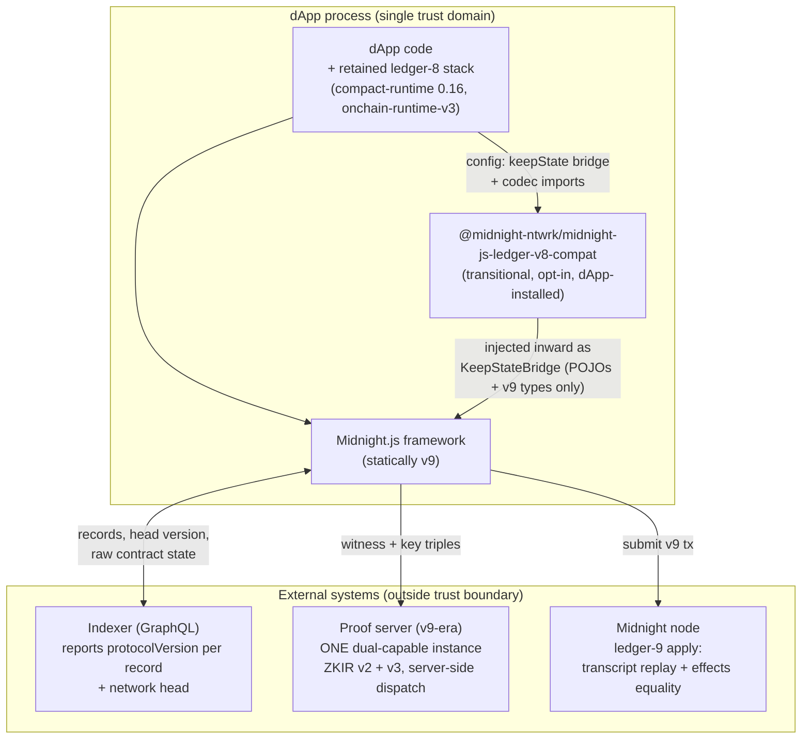
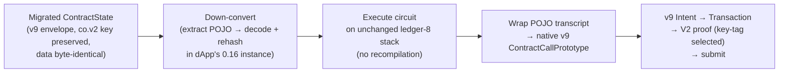
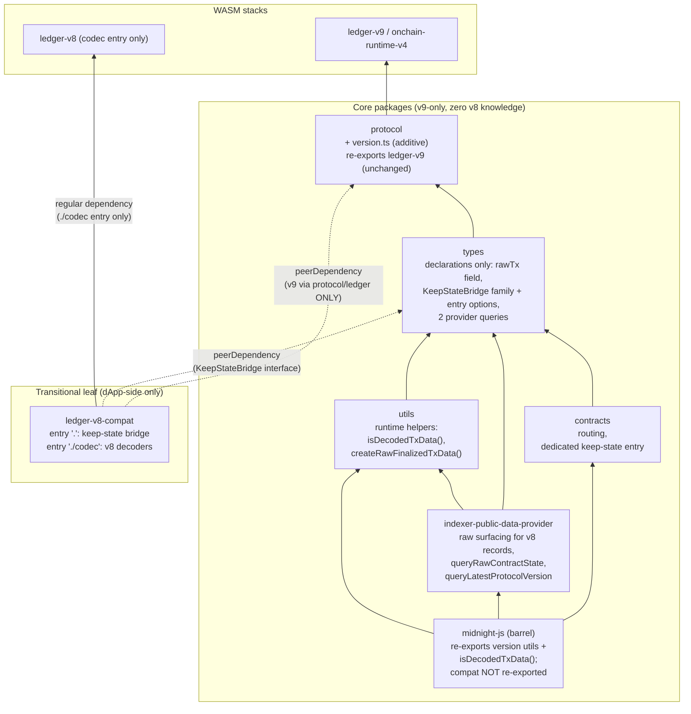
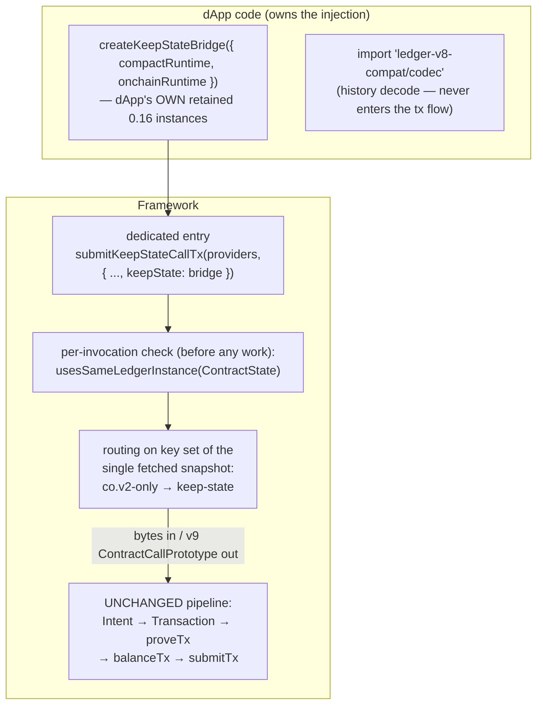
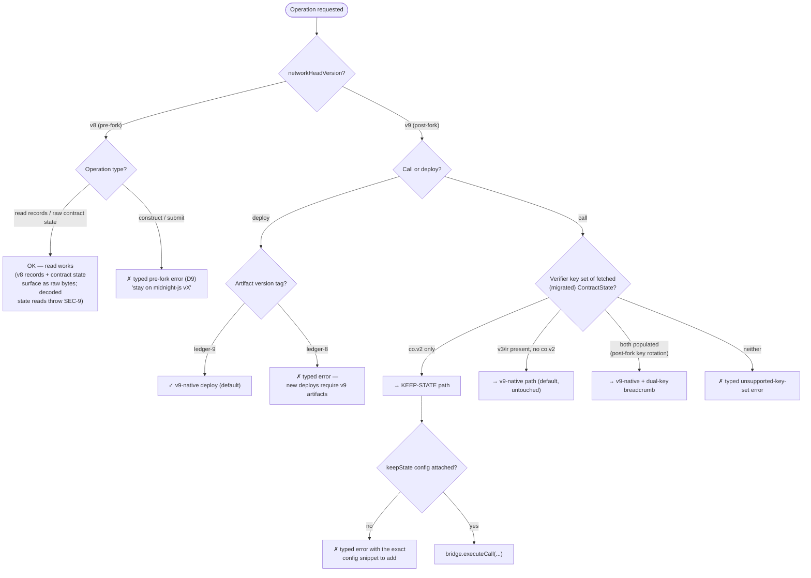
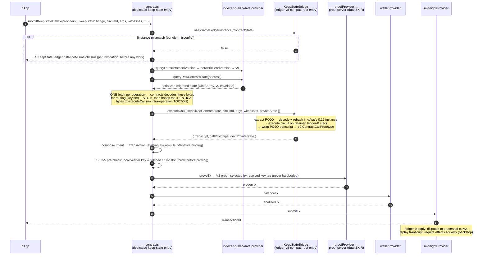
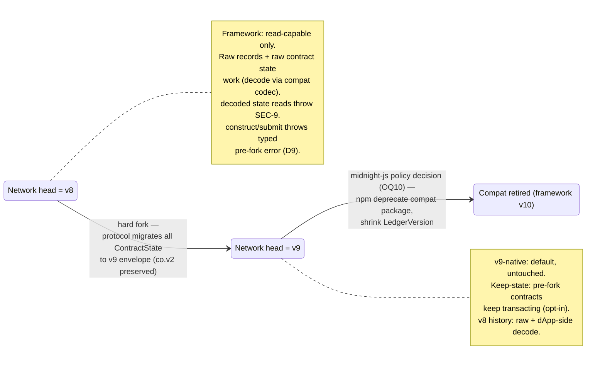
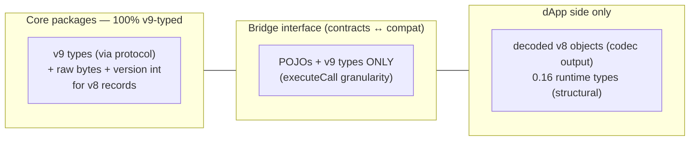
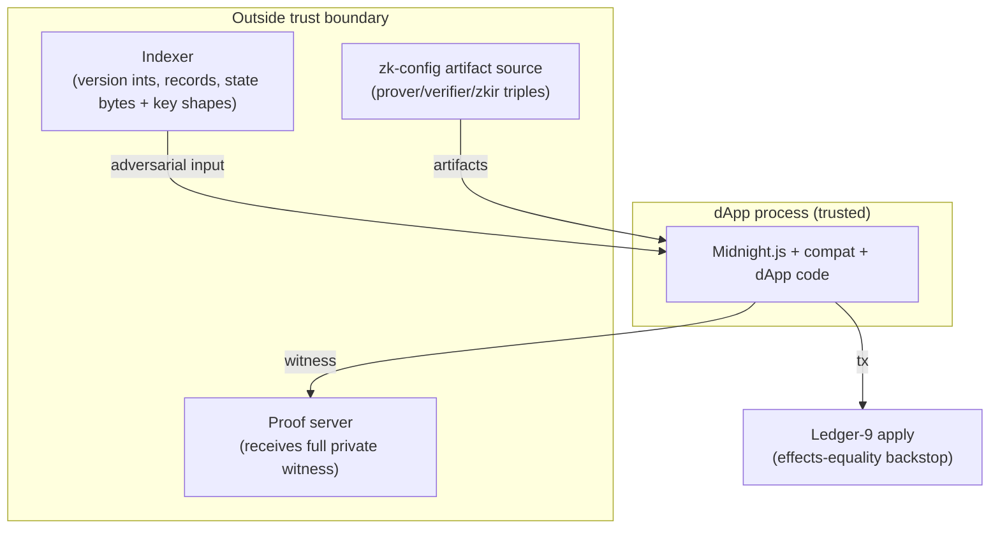
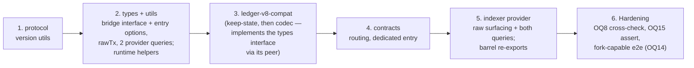

# Architecture Document — Ledger v8/v9 Support in Midnight.js (Hard-Fork Transition)

**Status:** Derived from Design Spec Draft v3.9 (2026-08-06 — upstream answers confirmed by @tkerber; OQ15 resolved by ruling)
**Source spec:** [`2026-07-09-ledger-v8-v9-dual-support-design.md` (branch `docs/superpowers-specs`)](https://github.com/midnightntwrk/midnight-js/blob/docs/superpowers-specs/docs/superpowers/specs/2026-07-09-ledger-v8-v9-dual-support-design.md)
**Related issues:** [#1004](https://github.com/midnightntwrk/midnight-js/issues/1004) · [#1005](https://github.com/midnightntwrk/midnight-js/issues/1005) · [#1006](https://github.com/midnightntwrk/midnight-js/issues/1006)
**Program:** Ledger v8→v9 Hard Fork Migration (SOW-Q3-10 / product#119)

---

## Table of Contents

1. [Purpose & Context](#1-purpose--context)
2. [Architecture Overview](#2-architecture-overview)
3. [Package & Component View](#3-package--component-view)
4. [Runtime Views](#4-runtime-views)
5. [Data & Type Boundaries](#5-data--type-boundaries)
6. [Security View](#6-security-view)
7. [Error Handling Strategy](#7-error-handling-strategy)
8. [Key Architectural Decisions](#8-key-architectural-decisions)
9. [Quality Attributes & Verification](#9-quality-attributes--verification)
10. [Lifecycle & Removal Plan](#10-lifecycle--removal-plan)
11. [Glossary](#11-glossary)

---

## 1. Purpose & Context

The Midnight blockchain performs a hard fork from Ledger protocol **v8** to **v9**. After the fork:

- On-chain history (blocks, transactions, events) before the fork height is encoded with **v8**; everything after with **v9**. One dApp session may read both.
- At the fork, the protocol **migrates every deployed contract's `ContractState` into the ledger-9 envelope**, preserving the pre-fork verifier key (`co.v2`). State *data* and call transcripts are **byte-identical** across versions — only the envelope changes. These migration facts are **contractual upstream guarantees** (#1005 answer 1).
- Pre-fork contracts stay compiled and executable only on the ledger-8 toolchain (compact-runtime 0.16 / onchain-runtime-v3).

Midnight.js today is hard-pinned to v9: `@midnight-ntwrk/midnight-js-protocol` re-exports `ledger-v9` / `onchain-runtime-v4` exclusively. The solution adds exactly three capabilities:

| Capability | Mechanism |
|---|---|
| **(a) Decode historical v8 records** | Framework surfaces v8 records as **raw bytes + protocol version**; the dApp decodes them with an opt-in compat codec |
| **(b) Construct & submit v9 transactions** | Unchanged — the pipeline stays statically v9 (decision D9) |
| **(c) Keep pre-fork contracts transacting post-fork** | **Keep-state**: down-convert migrated state, execute on the dApp's retained ledger-8 stack, wrap the transcript in a native v9 transaction with a V2 proof |

**Explicit non-goal:** this is *not* a generic multi-version framework. At most two ledger versions are ever live (support window: current + previous, D8), so version dispatch is a two-case switch at the few places that need it — no facades, no parameterised accessors (D10).

---

## 2. Architecture Overview

### 2.1 System context



Key structural facts:

- **The framework core never gains a v8 dependency** (FR5). All v8 capability lives in one transitional leaf package installed and injected by the dApp.
- **The integrity backstop is the ledger itself**: at apply, ledger-9 replays the transcript against real on-chain state and requires effects equality. Any indexer/state tampering is bounded to DoS/griefing — never fund or verification compromise.

### 2.2 The keep-state idea in one picture



No recompilation, no v9-compiled variant, no artifact selection. The contract, its keys, and its executing runtime all stay on ledger-8; only the transaction envelope and proof wrapping are v9-native.

---

## 3. Package & Component View

### 3.1 Package dependency diagram



CI dependency-graph gates enforce the arrows that must **not** exist:

1. No core package resolves `ledger-v8` or the compat package.
2. The compat package resolves **no direct `ledger-v9`** — v9 enters it exclusively through the `protocol` peerDependency, which guarantees a **single v9 WASM instance** in the process (closes the #1052 dual-instantiation axis by construction).

### 3.2 Component responsibilities

#### `protocol` (MJS-01) — version identity only

One new module, nothing else changes. No new dependencies, no WASM change, no subpath change.

```ts
export const LEDGER_VERSIONS = ['v8', 'v9'] as const;
export type LedgerVersion = (typeof LEDGER_VERSIONS)[number];

// Maps the indexer's protocolVersion int (encodes NODE version:
// major·1_000_000 + minor·1_000) to a LedgerVersion.
// Bounded per-MAJOR ranges (BC-1, v3.5): same node major ⇒ same ledger era
// (#1005 answer 6), so an unseen MINOR within a known major maps without error —
// a routine node upgrade (e.g. 2.2) must never brick construct/submit.
// Fail-fast ONLY on an unknown major (a new era is genuinely possible there);
// no open-ended `>=` — majors can rise faster than eras, so node 3.x might be v10.
// Exception (QA-1): major 0 is exempt — 0.x minors are semver-breaking and only
// node 0.22 is attested as v8; int 23_000 fail-fasts by design.
export const protocolVersionToLedger = (protocolVersion: number): LedgerVersion => { ... };

// Two syntactically distinct sourcing helpers — wrong pairing is visible in review:
export const versionOfRecord = (record: { protocolVersion: number }): LedgerVersion;      // read paths
export const networkHeadVersion = (source: { queryLatestProtocolVersion(): Promise<number> }): Promise<LedgerVersion>; // construct paths
```

Layering note: `types` depends on `protocol`, so `protocol` takes **structural parameters** — it cannot import provider interfaces. `protocolVersionToLedger` is the **sole narrowing point** from an untrusted `number` to the closed `LedgerVersion` set. `networkHeadVersion` is backed by the **additive provider query `queryLatestProtocolVersion()`** — today's `PublicDataProvider` exposes no head protocol version (see MJS-03 below; concrete indexer GraphQL field = OQ3d).

Version-int mapping (per-major bounded ranges — OQ1 + BC-1/v3.5):

| protocolVersion range | Node versions | LedgerVersion |
|---|---|---|
| 22 000 ≤ v < 23 000 | 0.22 only (major-0 exemption, QA-1) | v8 |
| 1 000 000 ≤ v < 2 000 000 | 1.x (any minor) | v8 |
| 2 000 000 ≤ v < 3 000 000 | 2.x (any minor) | v9 |
| unknown **major** | — | **typed error** (designed maintenance signal: table extends once per node *major*, after confirming that major's era) |

This deliberately diverges from the indexer's per-minor table: the indexer fail-fasting on an unmapped minor is its own operational choice; midnight-js must not amplify it client-side by bricking every dApp on a routine node minor release.

#### `@midnight-ntwrk/midnight-js-ledger-v8-compat` (new, D11) — the transitional package

One package per fork window, named for the version it retires with. Two entry points, so a keep-state-only consumer never pays the v8 WASM cost:

| Entry | Purpose | Dependencies |
|---|---|---|
| `.` (root) | `createKeepStateBridge({ compactRuntime, onchainRuntime })` — the keep-state implementation | peerDependencies: `protocol` (v9 **only via `protocol/ledger`**) + `types` (implements `KeepStateBridge`); 0.16 runtimes are dApp-supplied instances |
| `./codec` | v8 historical-record decoders (`decodeTransaction`, `decodeLedgerParameters`, `decodeZswapState`; final list = OQ3) | `@midnight-ntwrk/ledger-v8` as the **only regular v8 dependency in the whole tree**; importing the entry instantiates the v8 WASM — **the import is the opt-in** |

Internals of the root entry (exported only for the package's own tests):

- `extractEncodedStateValue` — v9-enveloped bytes → byte-identical POJO; throws on malformed input.
- `toExecutionState` — decode **and rehash** inside the dApp's own 0.16 runtime instance (bounded Merkle trees return non-rehashed and must be rehashed before any `checkRoot`).
- `wrapTranscriptV9` — POJO transcript + key tag → native v9 `ContractCallPrototype` (same v9 instance as the host app, guaranteed by peer resolution).

The 0.16 runtime types (`CompactRuntime016`, `OnchainRuntimeV3`) are **hand-maintained structural interfaces** covering only the members the package calls; a CI compile test against the real packages (devDependencies) detects drift.

#### `contracts` (MJS-02) — protocol-version orchestration

- Resolves the active version **per operation** (memoised within the operation only — no session-level subscription).
- Consumes the `KeepStateBridge` interface **declared in `types`** (v3.3 finding 1 — it is a provider-shaped seam, and repo convention keeps pluggable seams in `packages/types/src/`; feasible because `types` already depends on `protocol`). `executeCall` granularity, **only POJOs and v9 types in signatures**; witness/private-state shapes are **opaque generics** (v3.4 finding 4), so closing OQ13 cannot churn the published `types` surface:

```ts
export interface KeepStateBridge<TArgs, TWitnesses, TPrivateState> {
  /** Probe = the ContractState constructor from protocol/ledger — the symbol is PART OF
   *  THE CONTRACT (v3.3 finding 6) and the parameter is typed (v3.4 finding 8), so a
   *  wrong symbol is a compile error; compared by constructor-reference equality. */
  usesSameLedgerInstance(probe: typeof ContractState): boolean;
  executeCall(
    input: KeepStateCallInput<TArgs, TWitnesses, TPrivateState>
  ): Promise<KeepStateCallResult<TPrivateState>>;
}
```

- Ships keep-state as a **dedicated entry point** (e.g. `submitKeepStateCallTx`): pre-fork contracts are typed against the 0.16 toolchain and generally cannot satisfy the v9-pinned generics of the existing call entry. The v9-native entry's signatures and generics are **untouched** (FR7).
- **"Attach" defined (no invented lifecycle):** the `keepState` bridge attaches as a **typed options field of the dedicated entry** (options type declared in `types`) — *not* on the global providers object, which has no attach lifecycle. `contracts` runs the ledger-instance identity check **at the start of every keep-state entry invocation, before any fetch or proving**; mismatch throws `KeepStateLedgerInstanceMismatchError`. Keep-state stays invisible to v9-only code paths.
- **Single state snapshot per operation (v3.4 finding 7):** exactly one `queryRawContractState` fetch; `contracts` decodes those bytes itself (v9 decode via `protocol/ledger`) for routing + the SEC-5 pre-check, then hands the **identical bytes** to `executeCall` — routing, SEC-5 and execution can never disagree via an intra-operation TOCTOU window.

#### Providers (MJS-03) — shrunk scope

| Provider | Change |
|---|---|
| `indexer-public-data-provider` | v8-tagged records populate the **sole additive field `rawTx: Uint8Array`** (`protocolVersion` pre-exists on every record — v3.4 finding 5); `rawTx` presence is the runtime discriminant. Accessing the v9-typed `tx` on a v8 record throws a typed error naming the compat codec — via a **non-enumerable accessor** (v3.3 finding 3): `JSON.stringify`, spread, `structuredClone`, deep-equality and logging middleware never trip it; only a direct `tx` read does. Records are built with `createRawFinalizedTxData()` from `utils` (mandatory for provider **and** testkit mocks — an object literal would silently satisfy the interface without the throw). Additive `queryRawContractState` returns the **serialized** migrated state (bytes, never a WASM object across the package boundary). Additive `queryLatestProtocolVersion(): Promise<number>` backs `networkHeadVersion` (v3.3 finding 4; GraphQL source field = OQ3d). Both new members are **implementer-facing breaking** (consumer-compile-compatible): all in-repo implementations + testkit mocks update in the same PR. |
| Proof providers | **Unchanged.** The transition runs against **one dual-capable v9-era proof server** (#1005 answer 3); ZKIR self-describes its version, the server dispatches — no client-side leg routing (OQ11 dissolved). Retained pre-fork key triples pass through the existing configured `proofProvider`; the **pass-through plumbing ships with the dedicated keep-state entry (MJS-02)**. Open in OQ12: (a) the *supported* key-delivery API (the spike shipped keys ad-hoc), (b) the minimum server version with dual-ZKIR support actually shipped, (c) status of other proving modalities (e.g. DApp-connector local proving) for the migration guide. |
| `level-private-state-provider` | Expected version-agnostic (stores opaque values the migration never touches; under keep-state still written by the unchanged 0.16 stack); confirmed during MJS-03. |
| `types` | **Consumer-compile-compatible, declarations only** (revises v3.2's "additive-only"): the `rawTx` field, the generic `KeepStateBridge` family + keep-state entry options type, the two provider queries. Three recorded caveats: the documented `.tx` runtime break on v8 records; the SEC-9 pre-fork throw on decoded contract-state queries; the implementer-facing provider members. |
| `utils` | **New home for the runtime helpers** (v3.6 — `types` stays implementation-free per NFR4): `isDecodedTxData(d): d is FinalizedTxData & { readonly rawTx?: undefined }` (the guard; prefer it over try/catch) and `createRawFinalizedTxData(fields)` (installs the non-enumerable throwing accessor + populates `rawTx`). |
| `midnight-js` barrel | Re-exports the new version utils and `isDecodedTxData()`. The compat package is deliberately **not** re-exported. |

**`.tx` typing decision (v3.4 finding 1) — union rejected consciously:** the declared `tx` stays *required* — a documented lying type on v8 records. A discriminated union (`{ tx } | { rawTx }`) would be honest but **consumer-compile-breaking**: every existing consumer reading `.tx` unconditionally would stop compiling, defeating AC7. The weak compile-time signal is the accepted trade-off; the guard, the non-enumerable accessor and the TROUBLESHOOTING entry are the mitigation. **Copy semantics (QA-6):** spread/clone drops the accessor — `copy.tx` is silently `undefined` (no throw), `rawTx` survives, `isDecodedTxData(copy)` returns `false`; always re-guard after cloning.

### 3.3 How compat is injected into the existing transaction flow

The compat package is **not** spliced into the middle of the existing pipeline. Injection happens through one config object and one dedicated entry point; the v9-native flow is untouched end to end.



**1. Injection point — the `keepState` options field of the dedicated entry (the only seam).** The dApp installs the compat package and constructs the bridge, supplying its **own** retained 0.16 runtime instances. The bridge attaches as a **typed options field of the dedicated keep-state entry** (type declared in `types`) — *not* on the global providers object, so keep-state stays invisible to v9-only code paths:

```ts
import { createKeepStateBridge } from '@midnight-ntwrk/midnight-js-ledger-v8-compat';

await submitKeepStateCallTx(providers, {
  ...callOptions,
  keepState: createKeepStateBridge({ compactRuntime, onchainRuntime })
});
```

This is dependency inversion: `types` declares the `KeepStateBridge` interface (POJOs + v9 types only); the compat package implements it (via its `types` peerDependency); `contracts` consumes it; the framework never imports compat — it receives an instance from outside. The constraint is hard: the framework cannot reach the dApp's runtime module instances (#1052 WASM dual-instantiation), so the dApp must bring them.

**2. Attach = entry invocation — fail-fast validation.** There is no providers-object lifecycle in midnight-js; "attach time" means **the start of each keep-state entry invocation**. Before any fetch or proving, `contracts` calls `bridge.usesSameLedgerInstance(ContractState)` — the probe is the **`ContractState` constructor exported from `protocol/ledger`** (the pinned symbol is part of the contract, and the parameter is typed `typeof ContractState`, so a wrong symbol is a compile error); the bridge compares it by constructor-reference equality against its own import. This checks that compat and the host app share the same ledger-v9 module instance (guaranteed by the `protocol` peerDependency, but defeatable by bundler misconfiguration). A mismatch throws `KeepStateLedgerInstanceMismatchError` **before any work starts**, not as a mysterious proof failure minutes later.

**3. Use time — per-operation routing into a dedicated entry.** The existing v9 call/deploy entry is untouched (FR7). Keep-state ships as a separate entry (e.g. `submitKeepStateCallTx`) because a pre-fork contract's generated types target the 0.16 toolchain and cannot satisfy the v9-pinned generics of the existing entry. On each call, `contracts` fetches the migrated `ContractState` **once** and routes on its verifier-key set: `co.v2`-only → keep-state (only here is the bridge touched; a missing `keepState` config throws a typed error containing the exact snippet above **and both plausible causes** — a migrated pre-fork contract, or a v9-era ZKIR-v2 deploy mis-hitting the route while A4 is unconfirmed); `v3`/`ir` present → v9-native, bridge never invoked.

**4. Division of labour — bridge vs existing pipeline.** The bridge receives **bytes** (the raw migrated state from the provider's additive `queryRawContractState`) and returns a native v9 object:

```
contracts ──serializedContractState (Uint8Array)──▶ bridge.executeCall(...)
   ◀── { transcript (POJO), callPrototype: ContractCallPrototype (v9), nextPrivateState }
```

From that point the transaction re-enters the **unchanged** pipeline: `Intent → Transaction` (existing `zswap-utils`) → `proveTx` (existing `proofProvider`; V2 proof selected from the key tag, server dispatches on the ZKIR's embedded version) → `balanceTx` → `submitTx`. Proof, wallet, and midnight providers are unaware compat exists — the only addition is passing the retained pre-fork key triples through the existing `proofProvider`. That **pass-through plumbing ships with the dedicated entry (MJS-02)**; what stays open in OQ12 is the *supported* key-delivery API shape (the spike delivered keys ad-hoc), the minimum dual-ZKIR proof-server version, and the DApp-connector local-proving story — OQ12 gates the MJS-03 freeze precisely because of this.

**5. The non-injection: `./codec`.** The v8 history decoders never enter the transaction flow or the providers. The provider surfaces v8 records as `rawTx + protocolVersion`; the dApp imports `ledger-v8-compat/codec` and decodes on its own side. Importing that entry *is* the opt-in (it instantiates the v8 WASM).

Summary: one seam (the `keepState` options field of the dedicated entry), fail-fast validation at every invocation, data crossing the boundary only as bytes/POJOs — and the prove→balance→submit chain stays exactly what runs today.

### 3.4 Packaging & bundler reality (compat package)

The WASM/bundle cost of the transition is a **conscious, bounded decision**, not an oversight:

- **Who pays what.** A v9-only dApp ships exactly today's single WASM stack (AC6) — compat is never installed. A keep-state dApp adds its own retained 0.16 stack (`compact-runtime 0.16` + `onchain-runtime-v3`, dApp-owned — the framework never bundles them). Only a dApp that *also* decodes v8 history adds the v8 WASM, and only via the `./codec` entry — the two entry points exist precisely so a keep-state-only consumer never pays the v8 WASM cost.
- **Import-as-opt-in is deliberate (OQ6 withdrawn).** Upstream wasm-bindgen packages instantiate their WASM at import; the spec's earlier lazy-init design (`initLedgerV8()`, pre-init throws, CJS smoke tests) was withdrawn as moot — inside an explicitly-installed transitional package, at-import instantiation is acceptable and needs **no init choreography**. Verified on `ledger-v9@1.0.0-rc.3`; the same module layout on `ledger-v8` is confirmed at pin time (OQ2).
- **ESM-only is accepted.** Only transition-window dApps install the package — no dual `.cjs` build, no bundler-verification records; isolation is the package boundary itself.
- **Residual bundler risk is guarded, not assumed away.** Module resolution can be defeated by bundler misconfiguration (two module contexts — cf. the repo's Vite WASM guide); that is exactly what the per-invocation `usesSameLedgerInstance` check catches, with remediation pointing at the dual-instantiation guide.
- **Supply chain (OQ2).** The v8 dependency tree is confined to one `package.json`; the OQ2 checklist applies to it: verify org ownership of both npm scopes (`@midnight-ntwrk` vs `@midnightntwrk` — typosquat-shaped risk), exact pins + lockfile integrity, CI gate asserting only audited scopes/versions in the compat package's resolved tree.

---

## 4. Runtime Views

### 4.1 Operation routing (decision view)



The key-set truth table is **total** (the shape is an adversarial input) and routing and proof-version selection read the **same key tag**, so they can never disagree.

**Provenance caveat (A4, v3.3 finding 2):** the `co.v2`-only ⇒ keep-state edge is total over *shapes*, not *provenance* — it assumes every v9-era deploy populates `v3`/`ir`. Upstream keeps ZKIR-v2 contract support, so a v9-era ZKIR-v2 deploy carrying `co.v2`-only keys is plausible and would mis-route to keep-state. A4's confirmation is asked with OQ13; indexer deploy-era metadata is the recorded fallback second signal. Until confirmed: the missing-config error names both plausible causes, and the execution-path breadcrumb carries the key-set shape + contract address (QA-7) so a mis-route is reconstructable from logs.

### 4.2 Keep-state call (sequence view)



The overall transaction flow shape (`UnprovenTransaction → proveTx → balanceTx → submitTx`) is unchanged and statically v9.

### 4.3 Historical v8 record read (sequence view)

```mermaid
sequenceDiagram
    autonumber
    participant D as dApp
    participant P as indexer-public-data-provider
    participant K as ledger-v8-compat/codec<br/>(dApp-side import = opt-in)

    D->>P: query historical records
    P->>P: per-record dispatch on protocolVersion
    alt record tagged v9
        P-->>D: FinalizedTxData with decoded tx (static path, unchanged)
    else record tagged v8
        P-->>D: FinalizedTxData built via createRawFinalizedTxData()<br/>(rawTx populated — the sole additive field)
        Note over D: direct .tx read throws typed (non-enumerable accessor —<br/>stringify/spread/clone never trip it);<br/>narrow with isDecodedTxData() instead of try/catch
        D->>K: decodeTransaction(rawTx)
        K-->>D: decoded v8 object (distinct type, lives dApp-side only)
    end
```

The provider carries **zero v8 knowledge** — no injection seam, no v8 decode in core. Decoded v8 objects never inhabit v9-typed core interfaces. `rawTx` presence is the runtime discriminant (`isDecodedTxData()` from `utils`, re-exported by the barrel); a spread/cloned v8 record does **not** throw — its `tx` is `undefined`, `rawTx` survives — so re-guard after cloning (QA-6).

### 4.4 Transition timeline (state view)



A **stale-head race** exists at the fork boundary: the head can flip between version resolution and submit (proving takes minutes). **Detection predicate (QA-3, deterministic — independent of the node/indexer error taxonomy):** on submit rejection, re-query `queryLatestProtocolVersion`; the stale-head typed error is raised **iff** the head version differs from the one resolved at operation start — otherwise the original rejection propagates wrapped with `{ cause }`. The error advises re-resolution and rebuild — never a silent auto-retry.

---

## 5. Data & Type Boundaries

There is **no unified v8/v9 type surface**. The type discipline is enforced by placement, not discriminants:



| Layer | Rule |
|---|---|
| Core interfaces | Carry v8 data **only** as the additive `rawTx: Uint8Array` (v8 records only; `protocolVersion` pre-exists on every record). No unions, no brands, no casts. The declared `tx` stays required — a documented lying type on v8 records (weak compile-time signal by design); mitigations: non-enumerable throwing accessor, `isDecodedTxData()` guard narrowing on `rawTx` absence, mandatory `createRawFinalizedTxData()` factory (`utils`). |
| `KeepStateBridge` | Declared in `types`, generic over `TArgs`/`TWitnesses`/`TPrivateState` (opaque — OQ13 closes without churning `types`); POJOs + v9 types in signatures; no retained-stack (0.16) type crosses into core. |
| Shared keep-state POJO layer | `EncodedStateValue`, transcript/`Op`/`AlignedValue` — **byte-identical across versions** (spike-established, contractual). Fixtures are the authoritative check. |
| Package boundary | Raw serialized state crosses as **bytes**, never as a WASM-backed object. |

---

## 6. Security View

### 6.1 Trust boundaries



| Boundary | Data crossing | Failure mode → bound |
|---|---|---|
| Indexer | `protocolVersion` ints; records; `ContractState` key-set shape + bytes | Mis-route / garbage execution input → **bounded to DoS/griefing** by the effects-equality backstop |
| Proof server | Private witness + key triples | Witness exfiltration if compromised; single dual-capable instance is the sole witness recipient |
| zk-config source | Artifact triples | Tampered/stale artifacts → griefing; bounded by the SEC-5 `co.v2` byte-match pre-check |
| dApp-supplied runtime handles | Module references | Same trust domain; wrong module = typed failure (per-invocation identity check) |

### 6.2 Defence layers

1. **Sole narrowing point:** `protocolVersionToLedger` is the only place the untrusted int becomes a `LedgerVersion`; unknown ints fail fast.
2. **Total routing truth table:** all four key-set shapes have a deterministic outcome; routing and proof-version selection read the same tag.
3. **SEC-5 pre-proving check:** locally-resolved verifier key must byte-match the fetched state's `co.v2` slot — throws **before** proving starts.
4. **Per-invocation instance identity:** one `===` constructor-reference check (probe = the pinned `ContractState` constructor from `protocol/ledger`, typed parameter) catches bundler-induced dual v9 instances at entry invocation instead of as a proof failure minutes later.
5. **Ledger backstop:** transcript replay + effects equality at apply bounds all upstream tampering to DoS.
6. **Observability breadcrumbs (§6.3 of spec):** a plausible-but-wrong version passes narrowing silently, so every version-dispatch decision emits a debug-level `loggerProvider` breadcrumb (selected version, path, source, raw int). Residual risk (indexer head-version downgrade cross-check) is tracked as **OQ8** with a named risk owner.
7. **Privacy constraint on errors/logs:** version ints, sets, and key *identifiers* allowed; key bytes, decoded state contents, and raw payloads never.

---

## 7. Error Handling Strategy

Fail-fast, typed, remediation-bearing — never a silent default. Every new error class carries a stable `code` discriminant (the repo dual-publishes under two npm scopes; `instanceof` across mixed scopes fails silently).

| Condition | Error behaviour |
|---|---|
| Unknown `protocolVersion` **major** (unseen minors within a known major map without error — BC-1) | Typed error naming the observed int + supported set (distinct names for read vs construct paths) |
| Construct/submit with v8 head | Typed pre-fork-unsupported error ("stay on midnight-js vX for pre-fork operation") |
| Head flips between resolve and submit | Stale-head typed error raised **iff** a post-rejection head re-query differs from the operation-start version (QA-3); otherwise the original rejection propagates with `{ cause }`; advise re-resolve + rebuild; no auto-retry |
| Direct `.tx` read on a v8-tagged record | Typed error: "decode `rawTx` with `@midnight-ntwrk/midnight-js-ledger-v8-compat/codec`" — non-enumerable accessor (stringify/spread/clone never trip it); prefer the `isDecodedTxData()` guard |
| v9 instance mismatch at `keepState` attach | `KeepStateLedgerInstanceMismatchError` → dual-instantiation guide |
| Down-convert failure (malformed bytes, lost `StateValue` type) | Throw — never a silently wrong or empty state |
| Key set matches no supported proof version | Typed error (proof version always derived from key tag, never hardcoded) |
| Local verifier key ≠ on-chain `co.v2` (SEC-5) | Typed error naming both sources, **before proving** |
| Pre-migration (v6-envelope) state fetched (SEC-9) | Deterministic typed error on **decoded** reads only — the raw query + compat codec stay available pre-fork; never left to the v9 decoder happening to fail |
| Keep-state route without `keepState` option | Typed error containing the exact config snippet **and both plausible causes** (migrated pre-fork contract, or a v9-era ZKIR-v2 deploy while A4 is unconfirmed) |
| Post-fork deploy with ledger-8 artifacts | Typed rejection — new deploys require v9-compiled contracts |
| Wrong-version decode | Decoder error re-thrown with `{ cause }` + version context; fail-open decoders get a codec-side discriminant/round-trip check |

---

## 8. Key Architectural Decisions

| # | Decision | Rationale (condensed) |
|---|----------|----------------------|
| D1 | Explicit version handling; no mutable global | v8/v9 coexist in one session; a shared global is racy |
| D2 | `protocol` stays the single v9 seam — **including for the compat package** (peerDependency) | One v9 WASM instance by construction; layering preserved |
| D3 | Existing `protocol` exports unchanged | Backward compatibility is trivial — nothing moves |
| D4 | Version source = indexer `protocolVersion` | Already present; subject to the OQ8 cross-check stance |
| D5 | v8 types never unified with v9; core carries v8 data as raw bytes + int | Compile-time separation replaces runtime discriminants |
| D6 | Pre-fork contract support = **keep-state** | Spike-proven and contractual upstream; strictly simpler than recompile-and-upgrade |
| D7 | Keep-state lives in the compat package behind `KeepStateBridge` (declared in `types` — provider-shaped seams live with the provider interfaces); tx composition stays in `contracts` | Core stays 100% v9-typed; WASM identity preserved; no duplicated zswap logic |
| D8 | Support window: **current + previous** (policy, pending OQ10) | Bounds dependency/test growth; upstream imposes no ceiling — it is a midnight-js maintenance choice |
| D9 | **Pre-fork operation out of scope**; construct/submit is v9-only | No v8 construct pipeline exists; building one serves a shrinking window (KISS/YAGNI) |
| D10 | **No generic version-dispatch layer** | N never exceeds 2; a generic facade encodes an axis of variation an unknown v10 won't honour |
| D11 | Transitional package `…-ledger-v8-compat`, one per fork window, named for the version it retires with | Isolation is structural (don't install it); deletion is a package deprecation, not a breaking `exports` change |
| D12 | Fork date is not a design/priority driver | Delivery sequenced by dependency order; the date changes no line of the design |

---

## 9. Quality Attributes & Verification

| Attribute | How the architecture delivers it | How it is verified |
|---|---|---|
| **v9-native non-regression (FR7)** | Keep-state is a *dedicated* entry; v9 signatures untouched | Existing v9 suites run **unmodified** (diff gate); golden-fixture byte equality on deterministic stages captured on `main` before the first PR |
| **Structural isolation (FR5/NFR6)** | v8 confined to the compat package; v9 via peerDependency only | CI dependency-graph gates (both directions); export-surface strict-equality test |
| **Type safety (NFR2)** | Raw-bytes surfacing; POJO-only bridge; structural 0.16 interfaces | ESLint `no-explicit-any` + `as unknown` grep gate; compile-level test that 0.16 contract types fit the dedicated entry (and are *not* required to fit the v9 entry) |
| **Fail-fast (NFR1)** | Total truth tables; sole narrowing point; per-invocation entry checks | Every §7 error path negative-tested |
| **Dual-instance safety (#1052)** | Peer resolution + reference-equality probe | npm-alias tests on **both axes** (0.16 `onchain-runtime-v3-alt`; v9 `ledger-v9-alt`) |
| **Keep-state correctness** | Byte-identical POJO layer; rehash step; SEC-5 pre-check; ledger backstop | Round-trip fixtures (migrated, v6-envelope, tampered, both-keys, Merkle-bearing — minimal size); rehash-omission negative; effects-equality negative at the harness tier |
| **Cross-fork behaviour** | Per-operation version resolution | Fork-boundary scenario: one session reads v8 history + keep-state call + v9-native flow side by side; stale-head negative |
| **Observability** | Breadcrumbs at all four dispatch decision points | Injected-logger unit tests, strict equality on structured fields |

Test-tier note: a fork-capable e2e environment (node/indexer/proof-server migrating at a height) does not exist yet (OQ14) — until it does, proof/apply-level acceptance criteria are authoritatively gated at the unit/integration tier (recorded explicitly, not implied).

### Delivery sequence (dependency order, D12)



`types`+`utils` MUST precede the compat package (v3.4 finding 3) — compat implements the `types`-declared interface through its peerDependency.

---

## 10. Lifecycle & Removal Plan

The compat package is **born with its retirement plan**:

- **Versioning:** core packages take additive/minor changes only; the compat package versions independently and fast during the window (peer range on `protocol` tracks the framework major).
- **At framework v10:** `npm deprecate` the compat package and shrink `LedgerVersion` — the single compile-time signal downstream code keys on. Pre-announced in the package README from day one.
- **Caveat:** upstream keeps V2 proofs and ZKIR-v2 contracts supported indefinitely — retirement is a **midnight-js policy act** (OQ10). It strands any keep-state contract that has not graduated (post-fork key rotation installing v9 artifacts — the "both keys" routing shape); the graduation mechanism is still unconfirmed upstream and is confirmed together with the window policy.
- **Next fork:** whether a (v9, v10) transition needs its own compat package is decided by *that fork's spike* — never assumed.

### Open items that gate rollout

| Item | What remains | Blocks |
|---|---|---|
| OQ3d | Confirm the concrete indexer GraphQL field backing `queryLatestProtocolVersion` (expected: latest block's `protocolVersion`) | MJS-03 |
| OQ8 | Independent cross-check of the indexer head version (+ named risk owner meanwhile) | Production-readiness declaration for the transition window |
| OQ9 | Fixture porting per the §9 inventory + verification-harness decision (ledger-v9 local verify vs spike simulator) | Decode/keep-state test slices |
| OQ10 | Confirm "current + previous" window + graduation path | Retirement policy |
| OQ12 | (a) Supported key-delivery API for retained pre-fork key triples (spike shipped them ad-hoc); (b) minimum proof-server version with dual-ZKIR support shipped; (c) DApp-connector local-proving status for the migration guide | MJS-03 freeze; operator-facing rollout requirement |
| OQ13 | Final `executeCall` signature (dApp-side witness/private-state generic bindings only — the published `types` surface is generic and does not churn) + deploy-artifact version-tag field + **A4 confirmation** (does every v9-era deploy populate `v3`/`ir`?) | Compat API freeze; routing-provenance soundness |
| OQ14 | Fork-capable e2e environment (or spike simulator adoption) | Proof/apply-level AC promotion from unit/integration tier |
| OQ15 | **Resolved by ruling (v3.9):** no first-class discriminant API — the prepended serialized tag prefix **is** the sanctioned mechanism (parse to the second `:`, branch on the human-readable tag); implement the proving-seam assert in hardening — **non-blocking defence-in-depth** | Nothing (nice-to-have) |
| OQ7 | Wallet SDK `migrateState` (owner assigned); test-only shim port is a named work item; validated interim: run two Wallet SDK versions, restore v1 state with v2 code | Fee-paying cross-fork e2e |

---

## 11. Glossary

| Term | Meaning |
|---|---|
| **Keep-state** | The post-fork execution path for pre-fork contracts: down-convert migrated state → execute on the retained ledger-8 stack → wrap the transcript in a native v9 transaction with a V2 proof. No recompilation. |
| **Migrated state** | A contract's on-chain state after the fork: re-versioned into the v9 envelope with the pre-fork verifier key preserved in `co.v2`; data bytes unchanged. |
| **`co.v2` / `v3` / `ir`** | Slots in a `ContractState`'s operation verifier-key set. `co.v2`-only ⇒ pre-fork (keep-state); `v3`/`ir` ⇒ v9-native. |
| **V2 / V3 proof** | Proof versions tied to ZKIR v2 (pre-fork toolchain) and v3 (v9 toolchain). Selected from the resolved key tag, never hardcoded. |
| **Retained stack** | The dApp's own unchanged pre-fork toolchain outputs: compiled artifacts, keys, compact-runtime 0.16, onchain-runtime-v3. Owned and supplied by the dApp; the framework never touches them. |
| **`KeepStateBridge`** | The `executeCall`-granular generic interface (declared in `types`, implemented by the compat package, consumed by `contracts`) through which keep-state execution is injected as a typed options field of the dedicated entry. POJOs + v9 types only. |
| **`isDecodedTxData()` / `createRawFinalizedTxData()`** | Runtime helpers in `utils` (re-exported by the barrel): the `rawTx`-presence type guard for v8-tagged records, and the mandatory factory installing the non-enumerable throwing `tx` accessor (provider + testkit mocks). |
| **Effects-equality backstop** | Ledger-9's apply-time invariant: replay the transcript against real on-chain state and require identical effects — bounds all upstream tampering to DoS. |
| **#1052** | The WASM dual-instantiation issue: two module instances of the same WASM package break `instanceof`. Addressed by peer resolution + a per-invocation constructor-reference check at the keep-state entry. |
| **D9** | The decision that construct/submit is v9-only; pre-fork operation is out of scope. |
