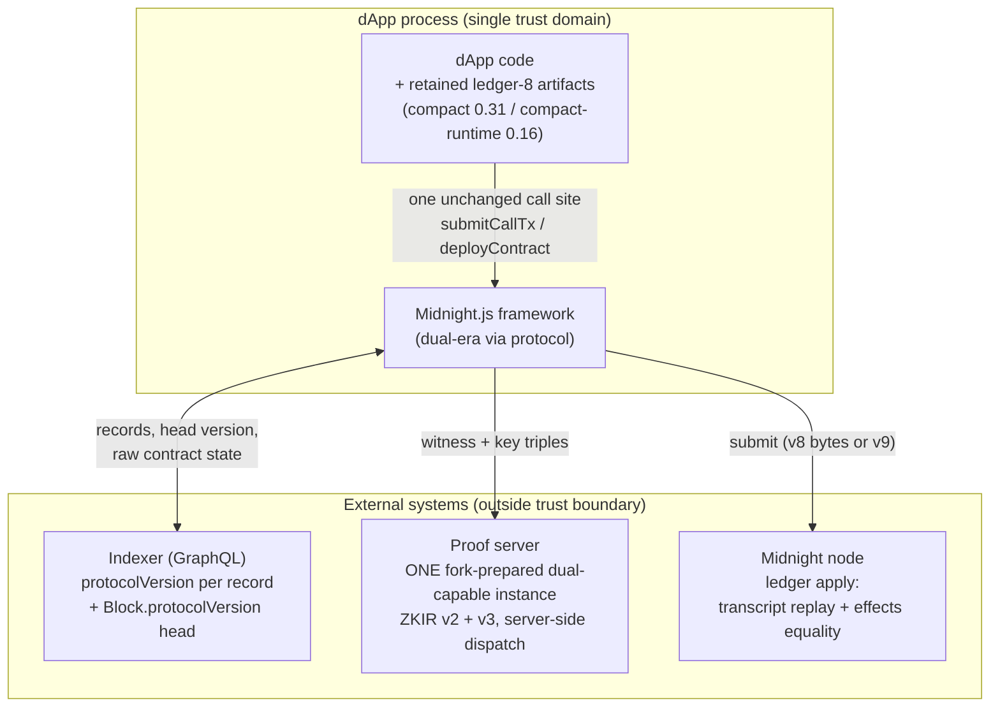
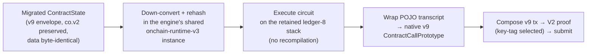
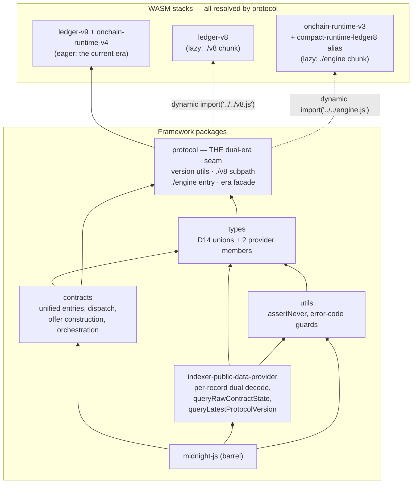
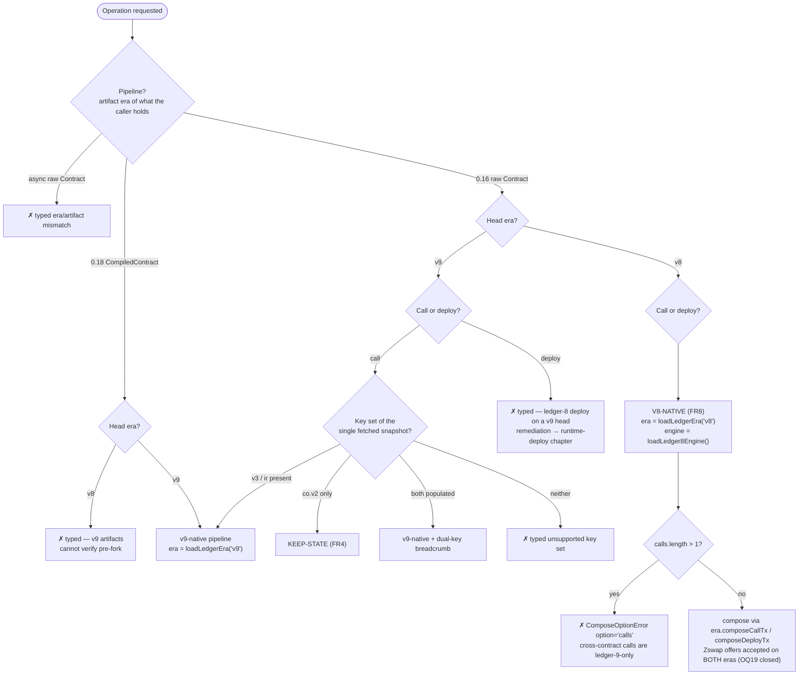
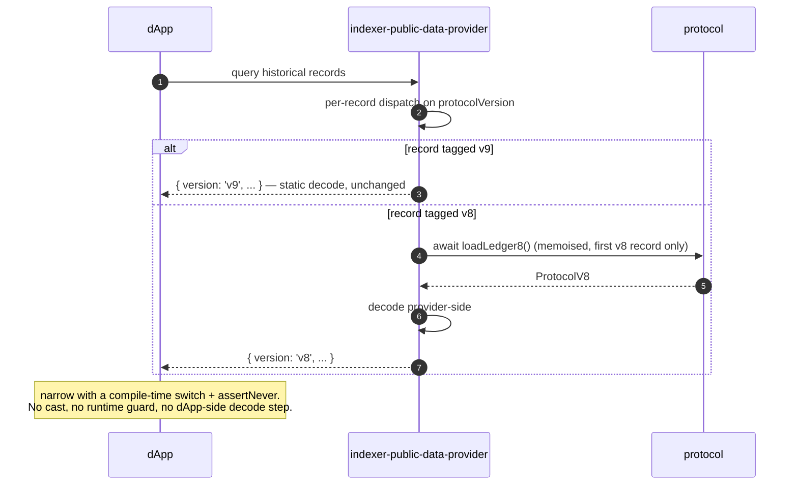
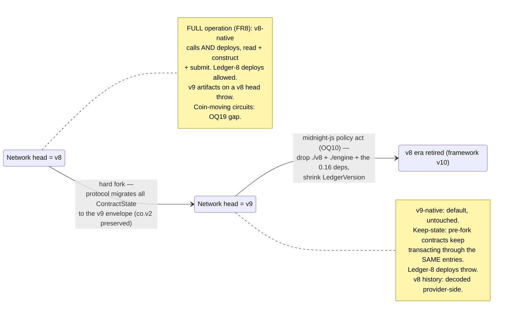
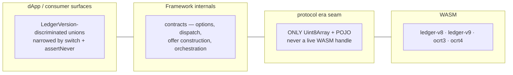
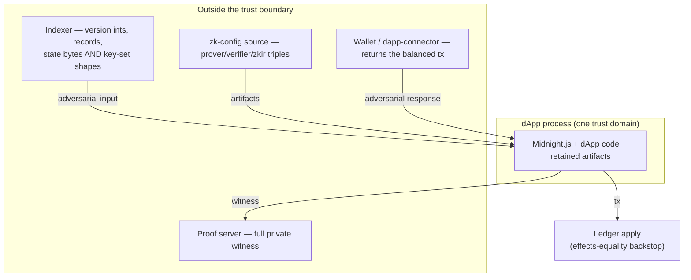
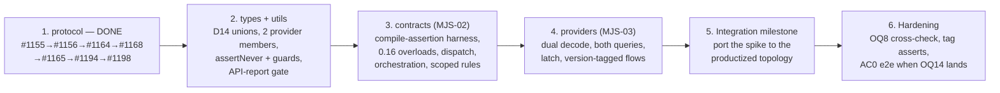

# Architecture Document — Ledger v8/v9 Support in Midnight.js (Hard-Fork Transition)

**Status:** Derived from Design Spec Draft **v5.4** (2026-09-03 — re-read against the integration tip of [#1218](https://github.com/midnightntwrk/midnight-js/pull/1218) and the #1006 tree #1204 → #1177 → #1207). **Corrected in this pass:** the Zswap refusal on the retained era is gone (OQ19 closed), and the node-version mapping now covers majors 1 and 2 only. Sections not touched by those two facts still carry their v5.3 derivation.
**Source spec:** [`docs/specs/2026-07-09-ledger-v8-v9-dual-support-design.md`](../specs/2026-07-09-ledger-v8-v9-dual-support-design.md)
**Related issues:** [#1004](https://github.com/midnightntwrk/midnight-js/issues/1004) · [#1005](https://github.com/midnightntwrk/midnight-js/issues/1005) · [#1006](https://github.com/midnightntwrk/midnight-js/issues/1006)
**Program:** Ledger v8→v9 Hard Fork Migration (SOW-Q3-10 / product#119)
**Records in the delivery tree (they ship with #1218; this document does not):** [ADR 0004](../adr/0004-lazy-v8-era-access-via-protocol-subpath.md) (lazy v8 era access via a `protocol` subpath) · [ADR 0006](../adr/0006-version-tagged-payloads-at-provider-seams.md) (version-tagged payloads at the provider seams) · [ADR 0007](../adr/0007-cross-the-era-boundary-with-plain-data-only.md) (only bytes and POJOs cross the era boundary) · the nine package documents under `packages/protocol/docs/`. Those are tracked with the code and this document is not, so they — not this file — are what code may cite; where they and this document disagree, they win.

> **Revision note.** This document was previously derived from spec v3.9 and described an architecture that no longer exists: a transitional `ledger-v8-compat` package, a `KeepStateBridge` injected by the dApp, a `rawTx` field on records, a dedicated keep-state entry point, and pre-fork construct/submit as an out-of-scope typed error. Every one of those was reversed between v4.0 and v5.3 — by owner rulings (unified entries, no transitional package, pre-fork operation in scope), by the OQ13 spike, and finally by the delivered code. It has been rewritten rather than patched. Where this document and the spec disagree, **the spec is authoritative**; where the spec and the shipped code disagree, the code is, and the spec v5.3 names each such divergence.

---

## Table of Contents

1. [Purpose & Context](#1-purpose--context)
2. [Architecture Overview](#2-architecture-overview)
3. [Package & Component View](#3-package--component-view)
4. [Runtime Views](#4-runtime-views)
5. [Data & Type Boundaries](#5-data--type-boundaries)
6. [Security View](#6-security-view)
7. [Error Handling Strategy](#7-error-handling-strategy)
8. [Key Architectural Decisions](#8-key-architectural-decisions)
9. [Quality Attributes & Verification](#9-quality-attributes--verification)
10. [Lifecycle & Removal Plan](#10-lifecycle--removal-plan)
11. [Glossary](#11-glossary)

---

## 1. Purpose & Context

The Midnight blockchain performs a hard fork from Ledger protocol **v8** to **v9**. Three facts drive everything below:

- **History is bi-versioned.** Blocks before the fork height are v8-encoded, everything after is v9. One dApp session may read v8 history and submit v9 transactions.
- **The protocol migrates state, not artifacts.** At the fork, every deployed contract's on-chain `ContractState` is re-enveloped into ledger-9 with the pre-fork verifier key preserved (`source.v2 → op.v2`, `v3`/`ir` empty). State *data* and call transcripts are **byte-identical** across versions. Contractual upstream (#1005 answer 1).
- **dApp upgrades cannot be coordinated with the fork height.** Existing dApps bump midnight-js *before* the fork, must keep transacting on the v8 chain, must keep working unchanged *at* the fork, and run on v9 afterwards. A framework version that operates on only one side of the fork is not adoptable.

The goal is therefore one framework major with **one version-agnostic API** (FR0). The developer never chooses a version-specific function; the ledger era is resolved at runtime from the network and from the contract. Migration is a version bump plus mechanical type narrowing where the dApp consumes version-divergent provider surfaces — and **zero changes at the fork itself**.

**Explicit non-goal.** This is not a generic multi-version framework. At most two eras are ever live (D8), so dispatch is a closed two-case `switch`. What v5.3 changes is *where* that switch lives — once, at the bottom, in the only package that holds both runtimes — not how many cases it has.

---

## 2. Architecture Overview

### 2.1 System context



Two structural facts replace the v3.9 picture:

- **The dApp installs nothing new and injects nothing.** There is no transitional package and no bridge object. The retained ledger-8 toolchain the framework needs is a dependency of `protocol`, not of the dApp (§3.2).
- **The integrity backstop is the ledger itself.** At apply it replays the transcript against real on-chain state and requires effects equality, which bounds indexer or state tampering to DoS/griefing for *integrity*. It bounds nothing about *disclosure* — see §6.

### 2.2 The keep-state idea in one picture



No recompilation, no v9-compiled variant, no artifact selection. The contract, its keys and its executing runtime all stay on ledger-8; only the transaction envelope and the proof wrapping are v9-native.

---

## 3. Package & Component View

### 3.1 Package dependency diagram



The dotted arrows are the whole isolation story, and they are enforced by **built-artifact gates**, not by the diagram: `dist-laziness.test.ts` asserts on the published `dist/index.js` that neither `ledger-v8`, nor the `./engine` subpath, nor `onchain-runtime-v3`, nor the `compact-runtime-ledger8` alias is linked statically.

Note the reversal from v3.9: `types` depends on `protocol` (it always did — the repo's own CLAUDE.md layering diagram is wrong about this, and correcting it ships with this work). That dependency is the reason the unified entries cannot move down into `protocol`: they need provider interfaces from `types`, and moving them would close a cycle.

### 3.2 Component responsibilities

#### `protocol` (MJS-01) — three seams, one package

`protocol` is the only package in the tree that resolves either ledger. It exposes the two eras through **three** accessors, and which one a caller reaches for is decided by a single rule.

| Accessor | Returns | Acquires | For |
|---|---|---|---|
| `loadLedger8()` | the raw `ledger-v8` module (`ProtocolV8`) | `ledger-v8` WASM | naming and decoding raw v8 records — the provider read paths |
| `loadLedger8Engine()` | `Ledger8Engine` (4 methods) | `onchain-runtime-v3` + the 0.16 glue | **fork-crossing** work: down-convert, execute, wrap |
| `loadLedgerEra(v)` | `LedgerEra` (4 methods), either era | `ledger-v8` when `v === 'v8'`; nothing when `'v9'` | **era-symmetric** work: read a state, compose a call, compose a deploy |

**The placement rule.** An operation belongs on the era facade **iff both eras perform it with the same inputs and the same result shape**. Everything else stays on the engine, where the era is the *subject* rather than a parameter — and keeps its `Ledger8*` name. `executeCircuit` is the instructive case: v9 execution runs through compact-js in `contracts`, so a symmetric signature would be a lie in the type, and it stays on the engine.

```ts
export interface LedgerEra {
  readonly version: LedgerVersion;
  extractState(raw: Uint8Array): EncodedStateValue;
  decodeContractState(raw: Uint8Array): ContractStatePojo;
  composeCallTx(options: ComposeCallOptions): Uint8Array;          // UNPROVEN, serialized
  composeDeployTx(options: ComposeDeployOptions): DeployResultPojo;
}

export interface Ledger8Engine {
  downConvertForExecution(state: EncodedStateValue): DownConvertedState;
  executeCircuit(options: ExecuteCircuitOptions): TranscriptPojo;
  executeConstructor(options: ExecuteConstructorOptions): ConstructorResultPojo;
  wrapKeepStateCall(options: WrapKeepStateCallOptions): ContractCallPrototype;
}
```

Three properties of this seam are load-bearing:

- **Only plain data crosses it** — `Uint8Array`s and POJOs, never a live WASM handle, in either direction. Two eras are two WASM instances and class identity does not survive a bundle boundary. Mechanised in the tests by `structuredClone` over every facade return value.
- **The engine and the facade are independent acquisitions.** The engine does **not** acquire `ledger-v8`; the facade does not acquire the 0.16 runtimes. A consumer that only executes circuits and binds them onto v9 never instantiates the multi-megabyte v8 WASM. A keep-state operation is the only path that holds both at once.
- **Memoised per era, failure not memoised.** One memo slot per era, never a shared slot — a shared slot hands the second caller whichever era was asked for first, silently reading one era's bytes with the other era's runtime. Both era objects are frozen.

**Version identity** (unchanged from v3.9, and delivered):

```ts
export const LEDGER_VERSIONS = ['v8', 'v9'] as const;
export type LedgerVersion = (typeof LEDGER_VERSIONS)[number];
export const protocolVersionToLedger = (protocolVersion: number): LedgerVersion => { /* ... */ };
export const versionOfRecord = (record: { protocolVersion: number }): LedgerVersion;                      // read paths
export const networkHeadVersion = (s: { queryLatestProtocolVersion(): Promise<number> }): Promise<LedgerVersion>;  // construct paths
```

`protocolVersionToLedger` is the **sole narrowing point** from an untrusted `number` to the closed `LedgerVersion` set. The int encodes the *node* version (`major·1_000_000 + minor·1_000`), and the table is keyed by **major**, not minor:

| `protocolVersion` range | Node versions | `LedgerVersion` |
|---|---|---|
| 1 000 000 ≤ v < 2 000 000 | 1.x, any minor | v8 |
| 2 000 000 ≤ v < 3 000 000 | 2.x, any minor | v9 |
| anything else, **node 0.x included** | — | typed error (`reason: 'unknown'`) |
| not a non-negative integer | — | typed error (`reason: 'malformed'`) |

This deliberately diverges from the indexer's table in **both** directions. Upward: the indexer fail-fasts on an unmapped *minor*, which midnight-js must not amplify client-side by bricking every dApp on a routine node minor release — hence per-major ranges. Downward, and **changed since v5.3**: the indexer maps node **0.x** and midnight-js no longer does. Earlier drafts carried a "major-0 exemption" row for node 0.22; as shipped that row is **struck**, because the framework meets only node 1.x or 2.x, so a 0.x `protocolVersion` is reported as unknown rather than resolved to v8. A fail-closed choice, commented as such in `version.ts` — do not restore it to mirror the indexer without a caller that needs it. Consequence: history cannot be read from a 0.22 indexer.

**Source layout.** `src/lib/` splits four ways — `v8/`, `v9/`, `shared/`, `era/` — so a path answers "which ledger does this touch?" without reading imports. The axis is **what a module is about, not what it links**: `v8/compose.ts` links no v8 at all (it takes the module as a typed parameter), and exactly zero files link v8 statically. Do not read isolation into the paths; the dist gates are the isolation.

#### `contracts` (MJS-02) — unified entries and dispatch

**One API, version-agnostic (D7).** The existing entries are the only entries. Each gains an **additive overload** accepting a 0.16-generated contract object alongside today's 0.18 signature:

```ts
// identical pre-fork, at the fork, and post-fork — and identical to every v9-native call
await submitCallTx(providers, { compiledContract, contractAddress, circuitId: 'increment', args });
```

That overload set is the largest single work item in the whole programme. The existing entries already carry four overloads anchored to the compact-js effect world, with the entire downstream type family parameterised on `C extends Contract.Any`; a 0.16 contract object satisfies none of it. "Additive overload" therefore means a **parallel options/result/provider type family plus circuit-id and args inference for the 0.16 shape**, with dispatch forking before any shared code.

**Era-tag discriminators** (OQ13 spike, verified on real artifacts of both eras). The dangerous case is not 0.16-vs-`CompiledContract`; it is a *raw* 0.18-generated `Contract` instance, which has the same own-property shape as a 0.16 one. The reliable split is asyncness: 0.18 codegen emits async members throughout, 0.16 codegen emits zero async functions.

| Held by the caller | Runtime discriminant | Outcome |
|---|---|---|
| compact-js `CompiledContract` | `Symbol.for('compact-js/CompiledContract')` on the prototype (global registry — survives duplicated copies) | v9-native pipeline |
| raw 0.16 `Contract` | own props exactly `['witnesses','circuits','impureCircuits','provableCircuits']`, all members **sync** | ledger-8 pipeline |
| raw 0.18 `Contract` | `initialState.constructor.name === 'AsyncFunction'`; module exports `expectedVk` | typed era/artifact-mismatch error — never silent mis-dispatch |

**What `contracts` no longer does.** #1194 moved the era-symmetric half of this component down into `protocol`. `contracts` does not compose transactions on either era and does not import `protocol/v8`.

| Concern | Owner |
|---|---|
| Overload typing, dispatch, fail-fasts, head resolution, single-snapshot fetch, stale-head handling | `contracts` |
| Zswap **offer construction** (per-recipient encryption-key resolver) | `contracts` |
| Private state, provider orchestration, proving / balancing / submission | `contracts` |
| Reading a contract state; composing a call or a deploy, either era | `protocol` — `LedgerEra` |
| Down-convert, circuit/constructor execution, keep-state wrap | `protocol` — `Ledger8Engine` |

`utils/ledger-utils.ts` is untouched and remains the production v9 path; repointing it at the facade is an explicit MJS-02 decision, not a mechanical consequence.

#### Providers (MJS-03)

| Provider | Change |
|---|---|
| `indexer-public-data-provider` | Per-record dispatch on `protocolVersion`: v9 records through today's static path unchanged; v8-tagged records decode **provider-side** via `loadLedger8()`, awaited inside the already-async query methods. Two new **required** interface members: `queryRawContractState` (serialized state + version, both envelopes) and `queryLatestProtocolVersion(): Promise<number>`, backed by `Block.protocolVersion` via the argument-less root query `block`. Both are implementer-facing breaking; all in-repo implementations and testkit mocks update in the same PR. The provider owns the **monotonic era latch** (D16). |
| Proof providers | Request payload version-tagged. One **fork-prepared** dual-capable server across the whole window (OQ16), self-dispatching on the ZKIR's embedded version — no client-side leg routing. Retained pre-fork key triples pass through the existing configured `proofProvider`. |
| Wallet / midnight | `balanceTx` / `submitTx` carry version-tagged payloads. The v8 arm is serialized tag-prefixed bytes, request **and** response — the pre-fork wallet deserializes with its own `ledger-v8`, its native wire format. The v9 arm's representation is **an open decision** (see §5). |
| `level-private-state-provider` | Expected version-agnostic — it stores opaque contract-defined values the envelope migration never touches. Not left as an expectation: a cross-window private-state round-trip test gates MJS-03. |
| `types` | Consumer-breaking exactly at the documented D14 set plus the two provider members; verified by a checked-in `.d.ts` API-report diff. |

#### What used to be here and is gone

The transitional `ledger-v8-compat` package, `KeepStateBridge`, `createKeepStateBridge`, the dedicated `submitKeepStateCallTx` entry, the `rawTx` field with its non-enumerable throwing accessor, `isDecodedTxData()` / `createRawFinalizedTxData()`, and the SEC-9 pre-fork throw on decoded state reads. All were superseded: the transitional package by the D11 owner ruling, the bridge and the dedicated entry by D7 (unified entries), and `rawTx` by D14 (discriminated unions). They are listed here so a reader who remembers them can tell "removed" from "not yet described".

---

## 4. Runtime Views

### 4.1 Operation routing (decision view)

Three orthogonal decisions, all invisible to the caller.



The key-set truth table is **total** — the shape is adversarial input — and verification-path selection and proof-version selection read the **same** key tag, so they cannot disagree.

**Provenance caveat (A4, unconfirmed).** The `co.v2`-only ⇒ keep-state edge is total over *shapes*, not *provenance*: it assumes every v9-era deploy populates `v3`/`ir`. Upstream keeps ZKIR-v2 contracts supported, so a v9-era ZKIR-v2 deploy carrying `co.v2`-only keys is plausible and would mis-route. Until A4 is confirmed, the contradiction errors name **both plausible causes** and the path-selection breadcrumb carries the key-set shape and contract address, so a mis-route is reconstructable from logs.

**The v8 arm's one refusal is a call tree, not coin movement (OQ19 closed, #1194).** A cross-contract call is a ledger-9-only feature a pre-fork contract cannot emit, so `calls.length > 1` raises `ComposeOptionError` with `option: 'calls'` rather than composing the first entry and dropping the rest. Zswap offers are ordinary options on **both** eras. See §7 and spec §4.3/OQ19.

### 4.2 Keep-state call (sequence view)

```mermaid
sequenceDiagram
    autonumber
    participant D as dApp
    participant C as contracts<br/>(the SAME submitCallTx)
    participant P as indexer-public-data-provider
    participant E as protocol<br/>LedgerEra('v9') + Ledger8Engine
    participant PP as proofProvider →<br/>proof server (dual-ZKIR)
    participant W as walletProvider
    participant M as midnightProvider

    D->>C: submitCallTx(providers, { compiledContract, contractAddress, circuitId, args })
    C->>C: pipelineEraOf(contract) ⇒ ledger-8
    C->>P: queryLatestProtocolVersion → networkHeadVersion ⇒ v9
    C->>P: queryRawContractState(address)
    P-->>C: serialized migrated state (v9 envelope) + version
    Note over C: ONE fetch per operation. Routing key-set, the SEC-5 check<br/>and the execution input all derive from this single snapshot —<br/>a second fetch would open an intra-operation TOCTOU.
    C->>C: tag-parse the raw state; compare to the resolved head era BEFORE any decode
    C->>E: era.extractState(raw)
    C->>C: SEC-5 pre-check — local verifier key ≟ fetched co.v2 slot (throws before proving)
    C->>E: engine.downConvertForExecution → engine.executeCircuit
    E-->>C: TranscriptPojo (plain data)
    C->>E: engine.wrapKeepStateCall ⇒ v9 ContractCallPrototype
    C->>E: era.composeCallTx({ calls, networkId, ttl, offers? })
    E-->>C: serialized UNPROVEN transaction bytes
    C->>PP: proveTx — V2, selected by the resolved key tag, never hardcoded
    PP-->>C: proven tx
    C->>W: balanceTx
    W-->>C: finalized tx
    C->>M: submitTx
    M-->>D: TransactionId
    Note over M: ledger apply: dispatch to the preserved co.v2,<br/>replay the transcript, require effects equality (backstop)
```

The **v8-native path (FR8)** is the same sequence with `loadLedgerEra('v8')` in place of `('v9')` and no wrap step — same method names, same option shapes, same serialized result. That symmetry is the point of the facade.

### 4.3 Historical v8 record read (sequence view)



Decoding moved **into** the provider (v3.9 had the dApp decode `rawTx` itself with a compat codec). A decode-only session never instantiates the 0.16 runtimes — only `ledger-v8`.

### 4.4 Transition timeline (state view)



**The fork moment is the primary scenario, not a rare race.** Proving takes minutes, so every in-flight operation at the fork hits a stale head. Detection (QA-3): on submit rejection, re-query the head — bypassing the latch unconditionally — and raise the stale-head error **iff** `protocolVersionToLedger(head)` differs from the operation-start **era**. Never the raw int: a same-era node minor bump mid-operation must not masquerade as a fork.

The remediation is **two-step and lives in the error text**, not only in the guide: (1) verify the original transaction did not and will not finalize — concretely, check its tx id against the history/watch query; (2) only then re-run. Bare "re-run" advice is a double-execution footgun. The contract-call leg of a duplicated run is caught by transcript replay against mutated state, but the zswap and fee legs are balanced with freshly selected coins and **can both finalize**. For a rejected ledger-8 *deploy*, "re-run" would hit the deploy-on-v9 fail-fast, so that branch points at the runtime-deploy chapter instead.

---

## 5. Data & Type Boundaries



| Layer | Rule |
|---|---|
| Consumer surfaces | **Closed `LedgerVersion`-discriminated unions** at every surface that can genuinely diverge — provider read surfaces and the 0.16 overload's return. Discriminant `version: LedgerVersion`; narrowing is a compile-time `switch` with `assertNever`, so at the v10 shrinking every seam fails to compile exactly where it must change. **Brands are rejected**: runtime-erased, need a parallel tag, applied via the casts NFR2 bans, and die at serialization boundaries. |
| The 0.18 overload's return | Stays today's **plain v9 shape**. By the dispatch rules that path provably cannot produce a v8 result, so a union there would be a narrowing tax on code that cannot diverge. Guarded instead by a runtime era-invariant assert with a registered code — and recorded as the one surface that is runtime-guarded rather than compiler-guarded, so it will **not** fail to compile at the v10 widening and must be revisited by hand. |
| Version-truth invariant | On every union arm, `version === protocolVersionToLedger(protocolVersion)`, derived at exactly one construction point per provider. Testkit mock constructors assert it. |
| The `protocol` era seam | Only `Uint8Array`s and POJOs, both directions, mechanised by `structuredClone` in the tests. This is what lets a caller hold a result without holding the module that produced it. |
| Tx-flow payloads — **v8 arm** | Serialized, tag-prefixed bytes (`{ version: 'v8', txBytes }`), request and response. Every one of these seams serializes immediately anyway, and a pre-fork wallet holds its own `ledger-v8` instance — a live-object handoff is #1052's dual-instantiation shape, while bytes are immune by construction. |
| Tx-flow payloads — **v9 arm** | **OPEN (spec OQ21).** v5.2 said "today's live-object shape", which assumed `contracts` holds a live `Transaction`. It no longer does: composition returns bytes on both eras. Deserializing back (compatible, but a round trip on the hot path and it re-creates the exposure the v8 arm's byte rule exists to avoid) versus making both arms bytes (honest and #1052-immune, but consumer-breaking beyond the documented D14 set) is a decision MJS-02 must take **before** Task 3.5. |
| Shared POJO layer | `EncodedStateValue`, transcript/`Op`/`AlignedValue` are byte-identical across eras (spike-established, contractual). **Fixtures are the authoritative check**; `AssertEqual`-style assertions detect API drift, not serialization drift. |

---

## 6. Security View

### 6.1 Trust boundaries



| Boundary | Data crossing | Bound |
|---|---|---|
| Indexer | `protocolVersion` ints; records; fetched `ContractState` — key-set shape **and** bytes | Integrity: DoS/griefing, bounded by the backstop. **Confidentiality: NOT bounded** — state bytes are circuit input alongside the private witness, and witness-derived public outputs reach the proof server, the wallet and the doomed broadcast *before* any rejection. A lying indexer has a chosen-state oracle. Status-quo-inherited, not new to this design, and folded into the OQ8 sign-off. |
| Proof server | Full private witness + retained key triples | Witness exfiltration if compromised; one fork-prepared server is the single witness recipient |
| zk-config source | Artifact triples | Tampered/stale artifacts → griefing; bounded by the SEC-5 verifier-key consistency checks |
| Wallet / connector | Version-tagged payloads out; **balanced tx back, which is adversarial input to submit** | v8 arm: tag-prefixed bytes + the tag parse. v9 arm: today's posture, no parse at the balance seam — unchanged from the current framework |
| dApp-supplied contract object / runtimes | Module references | Same trust domain; mismatched module contexts are a deterministic typed failure |

**The backstop is load-bearing and is asserted by a negative test that lives at a tier which does not yet exist (OQ14).** That is recorded, not implied: shipping without it is an explicit decision. The **harness-gated security-negative list** is (1) perturbed-state-bytes rejection at apply, (2) the A5 cross-era rewrap — worse than tampering if A5 fails, because a captured *rejected* v8 tx would finalize, (3) the double-submit backstop. Each is either a hard release gate or an explicitly owner-signed accepted residual risk with a resolve-by, decided item by item at the OQ9 close.

### 6.2 Defence layers

1. **Sole narrowing point** — `protocolVersionToLedger`; unknown *major* fails fast. It guards only unknown ints, so a plausible-but-wrong version passes silently: that residual is **OQ8**, and until it lands the breadcrumbs are the detection.
2. **Head↔state era cross-check on every call path, including v9-native** — the raw state's tag prefix is compared to the resolved head era **before any decode**, so the v9 decoder is never fed v8 bytes on the strength of a head int alone. Independent of decoder fail-open behaviour, which matters: six types in the v8 surface cross-accept silently (§9).
3. **Latch-bypassing re-read on mismatch** — post-latch, a lagging indexer replica serving a v8-envelope state would otherwise loop forever on "fork in progress". A mismatch first triggers a fresh head read; only if the fresh head still disagrees is an error raised, and if the fresh head is v9 it is a **distinct indexer-inconsistency error**, never the fork-in-progress text.
4. **Total key-set truth table** — all four shapes have a deterministic outcome; verification path and proof version read the same tag.
5. **SEC-5 pre-proving check** — the locally-resolved verifier key must byte-match the fetched state's slot; throws **before** proving.
6. **Instance identity** — one assertion at engine construction on the `onchain-runtime-v3` axis. Narrower than earlier drafts: the v9-ledger axis is not probed, because no second acquisition path exists there to compare against. Hold that consciously — #1052's v9 leg now rests on the single-`protocol`-instance argument alone.
7. **Tag parse as defence-in-depth** — bounded prefix scan, typed error on an absent or unknown tag. The tag is **unauthenticated**: anyone can prepend a well-formed tag to arbitrary content, so this defends against *accidental* arm confusion only. The node remains the authority on the body.
8. **Ledger backstop** — transcript replay + effects equality at apply.
9. **Breadcrumbs** — every dispatch decision emits a debug-level `loggerProvider` breadcrumb; the head-resolution one carries latch provenance, without which a poisoned-latch incident is indistinguishable from a live read in logs.
10. **Privacy constraint, transitively through the `{cause}` chain** — version ints, sets and key *identifiers* are allowed; key bytes, decoded state, key material and raw payloads are not. Upstream WASM errors embed offsets and payload fragments, and off-device loggers serialize whole chains, so every typed error wrapping an external cause must sanitize it before it can cross the `loggerProvider` seam. The biggest offenders are the QA-3 wrap of a node submit rejection (which can embed the whole serialized tx) and proof-server failures wrapping HTTP errors.

---

## 7. Error Handling Strategy

Fail-fast, typed, remediation-bearing — what happened, why, and the one next step, with concrete versions. Every class carries a stable `code` discriminant, because the repo publishes under two npm scopes and `instanceof` across mixed scopes fails silently.

**Registry placement, corrected.** v5.2 put one registry in `utils`. `protocol` sits *below* `utils` in the layering, so it owns its codes locally (`PROTOCOL_ERROR_CODES` in `packages/protocol/src/errors.ts`). The rule is therefore **one registry per package, one meta-test per registry**, with `utils` owning only the cross-package guards.

`protocol`'s 12 codes, all prefixed `MIDNIGHT_JS_P_`:

| Class | Raised when |
|---|---|
| `UnknownProtocolVersionError` | unknown node major — read and construct paths carry distinct codes |
| `UnknownLedgerVersionError` | `loadLedgerEra` with a non-era string (untyped JS callers only) |
| `Ledger8RuntimeMissingError` | the `./v8` or `./engine` chunk fails to load — never a raw module-resolution error |
| `Ledger8RuntimeInvalidError` | the retained glue resolves but is malformed |
| `Ledger8InstanceMismatchError` | duplicate `onchain-runtime-v3` at engine construction → dual-instantiation guide |
| `DownConvertFailedError` | down-convert for execution fails — never a silently wrong or empty state |
| `MerkleNotRehashedError` | a bounded Merkle tree is read before rehashing |
| `StateDecodeFailedError` | either facade read method fails; carries `version`, decoder diagnosis on `cause` |
| `ComposeFailedError` | composition fails; carries `version` |
| `ComposeOptionError` | option shape rejected; carries `version` |
| `UnknownLedger8AxisError` | the instance guard was asked for an axis outside the known set |
| `UnknownLedgerVersionError` | `loadLedgerEra` called with a value outside `LEDGER_VERSIONS` |

Two of these deserve comment because they changed the design rather than merely implementing it.

**The compose errors were renamed from `Ledger8*`, and the rename was forced.** `assertComposeEnvelope` is shared by both eras' legs, so a `Ledger8`-prefixed name would have been thrown out of a purely v9 operation. The general rule that fell out: era-neutral names wherever the era is a *parameter*, `Ledger8*` only where the era is the *subject*.

**There is no Zswap capability gap — the v5.3 statement here was wrong and is retracted (OQ19 closed, #1194).** `TranscriptPojo` **does** carry the post-call Zswap local state (`zswapLocalState`, decoded through the injected 0.16 glue), and **both** era arms read `guaranteedZswapOffer` / `fallibleZswapOffer` and carry the offer into the transaction. `Ledger8ZswapUnsupportedError` and its code have been deleted. Undecodable offer bytes raise `ComposeOptionError` with `option: 'zswapOffer'` identically on both eras. FR8's "full operation on the v8 chain" and AC0's "operates on a v8 head" are therefore **no longer overstated**; the remaining work is wiring `zswapStateToSegmentedOffer` in `contracts`, which is MJS-02 scope, not a capability limit.

**What the retained arm does refuse, and the two limits worth carrying into MJS-02.** (1) **A call tree** — `calls.length > 1` ⇒ `ComposeOptionError` with `option: 'calls'`, because a cross-contract call is ledger-9-only. (2) **A missing `verifierKeys` map on a deploy** — required on v8 always, and on v9 for any state still declaring a blank-keyed entry point. Separately, an **unpartitioned cross-contract callee** is not composable on either arm (`PreTranscript`'s `comm_comm` is unwired) — spec **OQ22**.

**An unpartitioned call must carry its recorded query context.** `CallTranscriptSource`'s `'unpartitioned'` variant takes a required `partitionContext: { block, effects, comIndices }` — `block`/`effects` from the **pre-call** context, `comIndices` from the **post-call** one. Drop it and a coin-receiving circuit cannot be partitioned (`stage: 'call-partition'`); hand the era an invalid one and you get `stage: 'call-partition-context'`. The commitment index is deliberately not re-derived, because `insertCommitment` accepts nonsense indices silently.

The dispatch-level errors owned by `contracts` are unchanged in intent from earlier revisions: era/artifact mismatch both directions, ledger-8 deploy on a v9 head (→ runtime-deploy chapter), head↔state era disagreement (→ QA-3 two-step remediation), indexer inconsistency (→ retry later), pipeline↔key-set contradiction naming **both** plausible causes of the `co.v2`-only case, unsupported key set, proof-version invariant, era-invariant assert on the 0.18 return, and the stale-head family.

---

## 8. Key Architectural Decisions

| # | Decision | Rationale (condensed) |
|---|----------|----------------------|
| D1 | Explicit version handling; no mutable global | Both eras coexist in one session; a shared global is racy |
| D2 | `protocol` is the single seam for **both** eras | One package owns the WASM boundary; consumers never name a ledger package |
| D3 | Existing `protocol` exports unchanged; v8-era additions are additive until v10 | Nothing moves, nothing re-points |
| D4 | Version source = indexer `protocolVersion` | Already present; subject to the OQ8 cross-check stance |
| D6 | Post-fork support for pre-fork contracts = **keep-state** | Spike-proven, contractual upstream; strictly simpler than recompile-and-upgrade |
| D7 | **Unified, version-agnostic entries** — additive 0.16 overload, fully internal dispatch | Owner requirement: the developer never chooses a version-specific function. Migration = bump only; zero change at the fork |
| D8 | Support window: current + previous | Bounds dependency and test growth; upstream imposes no ceiling, so retirement is a midnight-js policy act |
| D9 | **Pre-fork operation IS in scope** — construct/submit dispatches on the head era | *Reverses v3.9's D9.* v9-only construct made the new major non-adoptable: dApps upgrade before the fork and must keep transacting |
| D10 | No generic version-dispatch layer | N never exceeds 2; a generic facade encodes an axis of variation an unknown v10 will not honour. `loadLedgerEra` is not a counter-example — it is one closed two-case switch placed once, not a parameterised N-version layer |
| D11 | **No transitional package** — the engine and the facade live in `protocol`. Sub-decision **closed by implementation** (#1165 → #1194 → #1198) | *Reverses v3.9's D11.* With unified entries the engine has no user API, so a package bought nothing; migration DX collapses to "bump only". Accepted cost: engine hotfixes ride `protocol` releases |
| D12 | Fork date is not a design driver | Delivery sequenced by dependency order |
| D13 | Dual-ledger `protocol`: `ledger-v8` a regular dependency exposed only at `./v8`; runtime access only via memoised `loadLedger8()` — a **relative** dynamic import (ADR 0004) | Lazy WASM; install-time cost moves to core consciously — the price of "bump and it works" |
| D14 | Closed `LedgerVersion`-discriminated unions where surfaces genuinely diverge; v8 tx-flow arm = tag-prefixed bytes; brands rejected | Honest types over lying types; bytes close #1052 against the wallet's own `ledger-v8` |
| D15 | Instance sharing, guarded — **narrowed**: one assertion at engine construction, `onchain-runtime-v3` axis only | The v9-ledger axis has no second acquisition path, so a probe there would always pass and prove nothing |
| D16 | Monotonic era latch, **provider-owned and corroborated**; the QA-3 re-query bypasses it unconditionally | The fork is monotonic, so post-fork the query can decide nothing. Corroboration stops a single lying pre-fork response from becoming a permanent, self-hiding mis-dispatch |
| D17 | **Era-symmetric operations behind one facade; fork-crossing operations on the engine.** Placement rule: join the facade iff both eras do it with the same inputs and the same result shape | Era dispatch happens once, in the only package holding both runtimes, instead of once per consumer above it |
| D18 | **Only plain data crosses the era seam** — bytes and POJOs, never a live handle | Class identity does not survive a bundle boundary. Makes results comparable across eras and safe across a worker boundary. Open consequence: it also makes the v9 arm bytes (§5) |

---

## 9. Quality Attributes & Verification

| Attribute | How the architecture delivers it | How it is verified |
|---|---|---|
| **Fork-crossing (FR0/AC0)** | One entry set; era resolved per operation; keep-state and v8-native behind the same call sites | One session, unchanged code: pre-fork v8-native → fork → stale-head → re-run → keep-state → v9-native → reads its own v8 history. Authoritative only at the OQ14 tier; mocked head flips until then |
| **v9-native non-regression (FR7)** | The 0.18 overload's return stays plain v9; dispatch forks before shared code | Behavioural test files not touching D14 surfaces run **byte-unmodified** (sha256 manifest diff gate); golden-fixture byte equality on the enumerated deterministic stages, captured on `main` before the first change; structural equality where nonces make bytes non-deterministic |
| **Structural isolation (FR5/NFR6)** | Two dynamic imports, two lazy chunks; zero static v8 links | `dist-laziness.test.ts` on the **built** package; `v8-surface.test.ts` (no runtime v8 import elsewhere under `src/`); `protocol-acl.test.ts` + `export-surface.test.ts` on the public surface. Both dist gates verified **by sabotage** — a deliberate static re-export plus uncoded throws made them red, restoring made them green |
| **Era symmetry** | One facade, two arms, same signatures | `era-parity.test.ts`: `it.each(['v8','v9'])` over one scenario. `extractState` **deep-equal** across the migrated / pre-migration golden pair; the rest **shape** parity, because the two eras emit different serialization tags. Read that limit literally — it is not byte-equality of composed transactions |
| **Laziness** | Acquisition only at an async boundary, memoised per era | `era-load-era-v8-laziness.test.ts`: `loadLedgerEra('v9')` never calls `loadLedger8`; `('v8')` calls it exactly once. `v8-load-engine-laziness.test.ts`: the engine never acquires `ledger-v8` |
| **Error discriminability** | Stable codes plus classes | `dist-engine-errors.test.ts` / `dist-error-identity.test.ts` — discriminable by class **and** by code across the chunk boundary |
| **Type safety (NFR2)** | Unions + `assertNever`; no casts | ESLint `no-explicit-any` + a grep gate on `as unknown`; a checked-in `.d.ts` API-report diff for `types` and the barrel, where any undocumented entry fails CI; compile-error snapshot tests for the overload diagnostics |
| **Fail-fast (NFR1)** | Total truth tables; sole narrowing point; pre-proving checks | One negative test per §7 path, plus a per-registry meta-test asserting the code set equals the negative-tested set — a new error class cannot ship untested |
| **Dual-instance safety (#1052)** | Shared `onchain-runtime-v3`, asserted | npm-alias dual-instance negative on the ocrt3 axis; same-instance positive. The `ledger-v9-alt` axis is dropped (D15) |
| **Keep-state correctness** | Byte-identical POJO layer; rehash; SEC-5; ledger backstop | Round-trip fixtures (migrated, v6-envelope, tampered both ways, both-keys, Merkle-bearing, foreign `co.v2`-only); rehash-omission negative; effects-equality negative at the harness tier |

**Two verification facts worth carrying into MJS-02/03 rather than rediscovering:**

- **Six types in the v8 surface fail *open* across eras**, in both directions: `ZswapChainState`, `ZswapOutput`, `ZswapOffer`, `EncryptionSecretKey` (both its tagged and untagged forms), `PreBinding`, and the untagged `StateValue` POJO bridge. This is systemic across the Zswap value-transfer subsystem and the crypto-primitive wrappers, not an isolated quirk — **the tag-parse defence cannot discriminate era for any of them at the current pins.** By contrast `ContractState`, `Transaction`, `Intent`, `ContractOperation`, `LedgerParameters` and `SignatureEnabled` throw cleanly on cross-version bytes. Catching a cross-era mismatch on the six needs a semantic assertion, not `.toThrow()`.
- **A structural gate that stops matching must fail, not pass.** `v8-surface.test.ts`'s specifier regex was depth-limited and matched *nothing* once a module moved a directory deeper — and the assertion failed rather than passing vacuously. Write new gates the same way, and prove every new coverage glob live by raising its floor until it names the failure.

**Test-tier honesty.** A fork-capable e2e environment does not exist (OQ14), and neither does a static v8-era environment for the pre-fork FR8 tier. Until they do, proof- and apply-level acceptance criteria — **including AC0** — gate at the unit/integration tier. That is recorded, not implied, and the release gate stands regardless: production-ready-for-the-window is declared only after AC0 passes in the OQ14 environment or in an upstream fork rehearsal.

### Delivery sequence (dependency order, D12)



Step 1 closed at 33 test files / 446 tests / 0 skipped, 100/100/100/100 coverage, with the three `dist-*` gates confirmed running rather than skipping.

---

## 10. Lifecycle & Removal Plan

The v8 era is born with its retirement plan, and it retires from **one place**.

- **Versioning:** this ships as one new framework major — D14 is consumer-breaking and FR0 requires dApps to adopt exactly this major pre-fork. The migration guide is part of the deliverable.
- **At framework v10:** drop the `./v8` and `./engine` subpaths and the 0.16-era dependencies (`onchain-runtime-v3`, the `compact-runtime-ledger8` alias), shrink `LedgerVersion` — every D14 switch then fails to compile exactly where it must change — and collapse the unions to a single arm. One breaking `exports` change, in a major that D8 implies anyway. Pre-announced from day one.
- **The per-operation head query retires with the window**, unless the v10 fork's spike rules it a permanent fork-readiness primitive. Recorded so the perpetual round-trip cost is a decision rather than an accident.
- **Convention for future forks is era-relative:** the current era is native in-framework; the previous era's surface and engine live behind the versioned subpath and retire with it. Whether the (v9,v10) window needs the same shape is decided by *that* fork's spike — never assumed.
- **Caveat:** upstream keeps ZKIR-v2 contracts transactable indefinitely, so retirement is a midnight-js policy act and strands any keep-state contract that has not graduated. The graduation mechanism — post-fork key rotation installing v9 artifacts, the "both keys" shape — is still unconfirmed upstream.

### Open items that gate rollout

| Item | What remains | Blocks |
|---|---|---|
| OQ7 | Wallet SDK `migrateState` — a **hard FR0 dependency**. Interim: the two-SDK workaround, validated as a test mechanism only and never evaluated as a production story. A PO decision point exists with a date | The release's transition-window readiness; the guide's minimum-wallet-version statement |
| OQ8 | Independent cross-check of the indexer head version. The sign-off must cover the real bound — integrity DoS-bounded, **disclosure not bounded** — deploys by name (no state fetch ⇒ zero cross-check), and the no-logger gap | Production-readiness declaration |
| OQ9 | Owner ruling on the harness-gated security-negative list, item by item; `ledger-v9`'s apply/well-formedness surface not exhaustively verified | Decode/engine test slices |
| OQ10 | Confirm the window policy and the graduation path | Retirement policy |
| OQ12 | Key-delivery API for retained triples; minimum dual-ZKIR proof-server version. Resolve-by is the pre-fork milestone **minus operator lead time**, not "before MJS-03" | MJS-03 freeze; operator rollout |
| OQ13 | A4 (can a v9-era deploy produce a `co.v2`-only state?) and A5 (era-specific proof binding — the rewrap defence); the split-topology integration milestone. **Engine placement: closed** | Routing-provenance soundness; the A5 harness negative |
| OQ14 | Fork-capable e2e environment; **and** a static v8-era environment for the pre-fork FR8 tier | Promotion of AC0 and the apply-level criteria off the unit tier |
| OQ17 | Upstream confirmation that in-flight v8 transactions are **hard-rejected** at the fork. "A grace window only reduces rejections" is wrong from a security standpoint — a grace window is precisely what turns bare re-run advice into double-execution | Release gate, or a named owner-signed residual risk |
| OQ18 | Scope ruling for DApp-connector-proving dApps, which today have **no** stated fork-crossing story | Potential FR0 hole |
| **OQ19** | **NEW.** Coin-moving circuits on the retained era. Measure the real boundary (does keep-state fail too?), then rule: extend `TranscriptPojo` to carry the post-call Zswap state, or declare them out of scope | FR8/AC0 scope; potentially an FR0 hole of the same class as OQ18 |
| **OQ20** | **NEW.** Scoped transactions have no composition path on a v8 head. Rule together with OQ19 — the "one facade call per scope" option is blocked by the same one-call limit | MJS-02 Task 3.7 |
| **OQ21** | **NEW.** The v9 tx-flow arm's representation now that composition returns bytes on both eras. Consumer-visible, so it needs an AC7 allowlist entry and an AC9 recipe if it goes the honest way | MJS-02 Task 3.5 |

---

## 11. Glossary

| Term | Meaning |
|---|---|
| **Keep-state** | The post-fork path for pre-fork contracts: down-convert the migrated state → execute on the retained ledger-8 stack → wrap the transcript in a native v9 transaction with a V2 proof. No recompilation, no v9 variant, and reached through the same unified entry as everything else. |
| **v8-native** | The pre-fork path: the same engine execution, composed as a v8 transaction through `loadLedgerEra('v8')` and carried as serialized bytes end to end. |
| **Migrated state** | A contract's on-chain state after the fork: re-enveloped into ledger-9 with the pre-fork verifier key preserved in `co.v2`; data bytes unchanged. |
| **`co.v2` / `v3` / `ir`** | Slots in a `ContractState` operation's verifier-key set. `co.v2`-only ⇒ pre-fork (keep-state); `v3`/`ir` ⇒ v9-native; both ⇒ v9-native with a rotation breadcrumb; neither ⇒ typed error. |
| **`LedgerEra`** | The facade object returned by `loadLedgerEra(version)`: four era-symmetric methods, identical signatures on both eras, plain data only across the seam. |
| **`Ledger8Engine`** | The four fork-crossing operations returned by `loadLedger8Engine()`: down-convert, execute circuit, execute constructor, wrap keep-state call. Does not acquire `ledger-v8`. |
| **Retained stack** | The pre-fork toolchain outputs the dApp keeps unchanged: compiled artifacts and keys (compact 0.31 / compact-runtime 0.16). The *runtimes* the framework needs to run them are `protocol`'s dependencies, not the dApp's. |
| **Era-symmetric / fork-crossing** | The placement rule (D17). Symmetric = both eras, same inputs, same result shape ⇒ the facade. Fork-crossing = only the retained era can do it ⇒ the engine, and it keeps its `Ledger8*` name. |
| **Effects-equality backstop** | The ledger's apply-time invariant: replay the transcript against real on-chain state and require identical effects. Bounds upstream tampering to DoS **for integrity only**. |
| **#1052** | The WASM dual-instantiation issue: two module instances of the same package break `instanceof`. Addressed by one `protocol` instance, the ocrt3 assertion at engine construction, and bytes at the tx-flow seams. |
